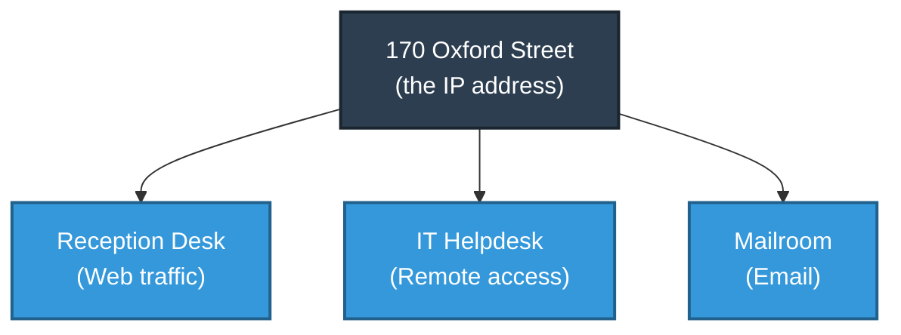
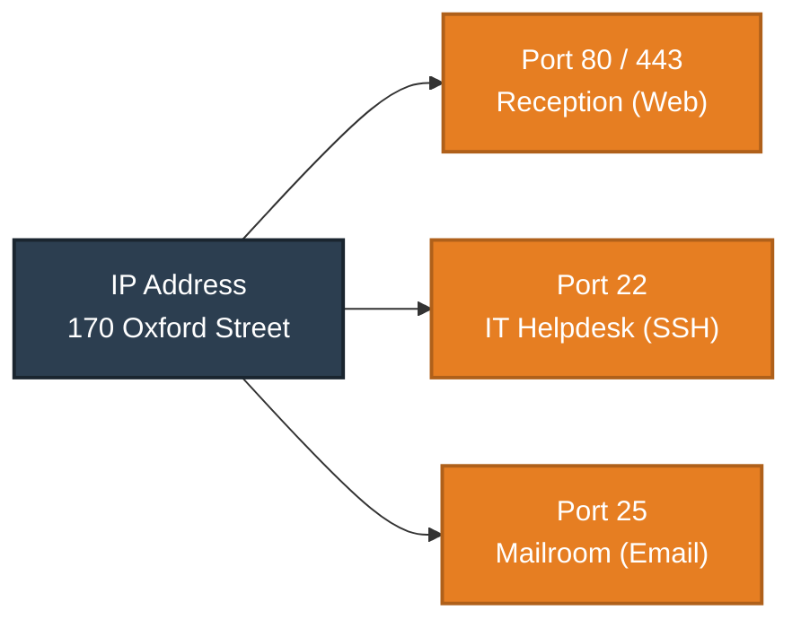
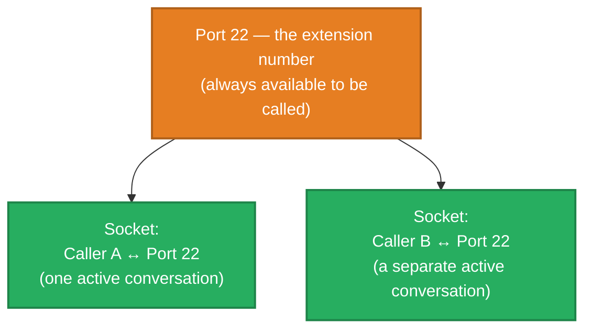
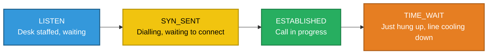
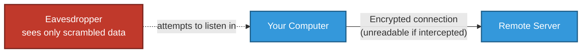
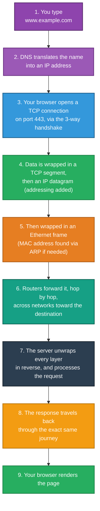

# Reaching the Right App
### Ports, Sockets & Everyday Tools

---

## Introduction

An IP address gets data to the correct *machine* — but a single machine often runs many different network applications at once: a web server, an email server, a remote-access service, and more. This document explains how data finds its way to the correct *application* once it arrives, introduces two everyday tools for inspecting and using network connections, and closes with a complete, end-to-end walkthrough tying every part of this document series together.

> This document is part of a series explaining networking fundamentals. It focuses on the **Application Layer** — the topmost layer, where a message finally reaches the specific program that needs it.

---

## 1. The Problem: One Address, Many Applications

**Real-world analogy — an office building:** The building's street address gets a delivery to the right building, but the building itself contains many different departments and desks. A delivery marked only "170 Oxford Street" with no further detail would leave the receptionist unsure which department it's actually meant for.



**Ports** solve exactly this problem — they are numbered "extensions" within a machine, letting the same IP address host many independent applications, each reachable at a different, specific number.

---

## 2. Ports — The Extension Number Within the Building

A **port** is simply a number attached to a connection, identifying which specific application on a machine the data is intended for.

| Port | Common Use | Real-World Equivalent |
|---|---|---|
| **80** | HTTP (unencrypted web traffic) | The main reception desk |
| **443** | HTTPS (encrypted web traffic) | The secure reception desk |
| **22** | SSH (secure remote access) | The IT helpdesk desk |
| **25** | SMTP (email sending) | The mailroom |
| **53** | DNS (name lookups) | The building's own information desk |
| **3389** | Remote Desktop | A separate remote-access office |



### Port Ranges — A Quick Reference

Ports aren't randomly numbered — they fall into three organized ranges:

| Range | Name | Typical Use |
|---|---|---|
| 0 – 1023 | Well-known ports | Standardized services (web, email, SSH) — usually require admin privileges to use |
| 1024 – 49151 | Registered ports | Specific applications register these for their own use |
| 49152 – 65535 | Dynamic / ephemeral ports | Temporarily used by your own device as the "return address" when it starts an outbound connection |

---

## 3. Sockets — One Specific, Active Conversation

If a port is an extension number, a **socket** is the actual live phone call currently happening on that extension — the specific, active combination of an IP address, a port number, and a protocol (TCP or UDP).

**Real-world analogy:** The IT helpdesk extension (port 22) can receive many separate calls throughout the day, but each individual call — this specific conversation, right now, between this specific caller and that desk — is the socket.



A single port number can be involved in many simultaneous sockets at once — just as an IT helpdesk desk can be mid-conversation with several different callers throughout the day, provided each conversation is tracked separately.

---

## 4. Netstat — Seeing Every Active Conversation on a Machine

**`netstat`** (or its modern equivalent, `ss`, on many systems) is a tool that lists every active network connection on a machine right now — genuinely useful for answering "what is this machine currently talking to, and on which ports?"

**Real-world analogy:** This is the equivalent of a phone system's live call log — showing every currently active call, which extension it's using, who it's connected to, and what stage that call is in.

```
$ netstat -nt
Proto  Local Address        Foreign Address        State
tcp    172.31.14.118:22     81.109.57.236:59914    ESTABLISHED
tcp    172.31.14.118:45636  52.94.56.138:443       TIME_WAIT
```

| Column | Meaning |
|---|---|
| **Local Address** | This machine's own IP and port involved in the connection |
| **Foreign Address** | The other machine's IP and port |
| **State** | What stage this specific conversation is currently in |

### Common Connection States, Explained

| State | Real-World Equivalent |
|---|---|
| **LISTEN** | A desk is staffed and ready to answer, but no call is currently in progress |
| **SYN_SENT** | "I've dialled and am waiting for someone to pick up" — the handshake has just begun |
| **ESTABLISHED** | A call is actively in progress — the full handshake completed successfully |
| **TIME_WAIT** | The call has just ended, but the line is briefly held before being freed up again |
| **CLOSE_WAIT** | The other side has said goodbye, but this side hasn't finished wrapping up yet |



---

## 5. SSH — A Private, Encrypted Line to Another Machine

**SSH (Secure Shell)** allows one machine to remotely and securely control another over a network — most commonly used to manage a server from a distance, via port 22.

**Real-world analogy:** Older remote-access methods were like having a conversation on a party line where anyone could listen in — everything, including passwords, was sent in plain, readable text. SSH is a private, encrypted phone line instead: even if someone intercepts the conversation, all they hear is unintelligible noise.



```
$ ssh remote_username@host
```

**SCP (Secure Copy)** uses this exact same encrypted connection, but to transfer files rather than run commands:

```
$ scp user@host:file .
```

### A Note on Trust

The first time you connect to a new server, SSH shows a warning that the server's identity "can't be established" and asks whether to continue. Your SSH client then remembers that server's unique identity for future connections, and will loudly warn you if it ever changes unexpectedly — a strong signal that something suspicious, such as an impersonation attempt, may be happening.

---

## 6. The Complete Journey, Start to Finish

Every document in this series has explained one piece of a much larger picture. Here is the entire journey, told as one continuous story, from typing a web address to a page appearing on screen.



### Mapped to the Layered Model

| Step | Layer Involved | Covered In |
|---|---|---|
| Typing a name | Application | This document |
| DNS lookup | Application (supporting service) | *Finding Things by Name* |
| TCP handshake, port 443 | Transport / Application | *Reliable vs Fast* & this document |
| IP addressing, routing | Internet | *Addressing & Routing Across Networks* |
| Ethernet framing, ARP | Network Interface | *Getting Data Across the Room* |
| The physical signal itself | Hardware | *How Networks Talk* |

This is the payoff of understanding each layer individually: once every piece is familiar, this entire journey — something that happens in a fraction of a second, dozens of times on an average web page — becomes fully explainable, step by step, rather than an invisible black box.

---

## 7. Bringing It All Together

| Concept | Real-World Analogy | Technical Meaning |
|---|---|---|
| Port | An extension number within a building | Identifies which specific application data is intended for |
| Socket | One specific, active phone call on that extension | The live combination of IP address, port, and protocol |
| `netstat` | A live call log for the whole building | Lists every active network connection and its current state |
| ESTABLISHED | A call currently in progress | A completed handshake, data actively flowing |
| SSH | A private, encrypted phone line | Secure, encrypted remote access to another machine |

**In summary:** ports let a single machine run many independent applications simultaneously, each reachable at its own numbered extension, while a socket represents one specific, currently active conversation happening on a given port. Tools like `netstat` make these active conversations visible, and protocols like SSH allow that conversation to happen securely and privately. Put together with every other document in this series, this completes the full picture of what happens, layer by layer, between typing a web address and seeing the page appear on screen.

---

*Prepared as a technical reference document.*
