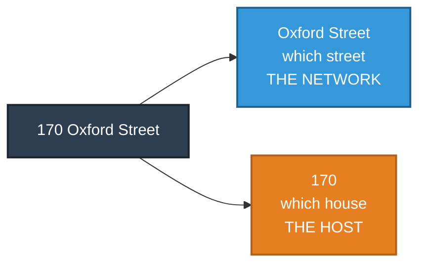
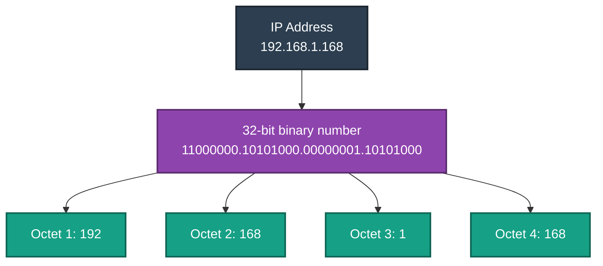
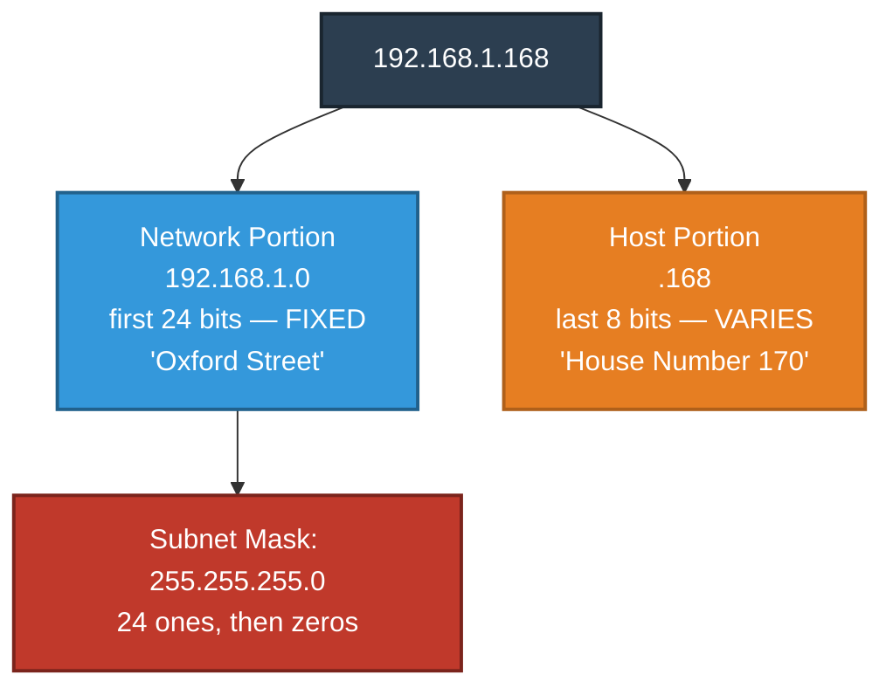
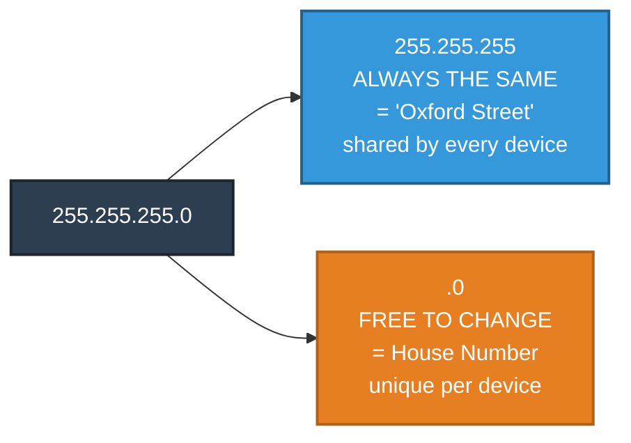
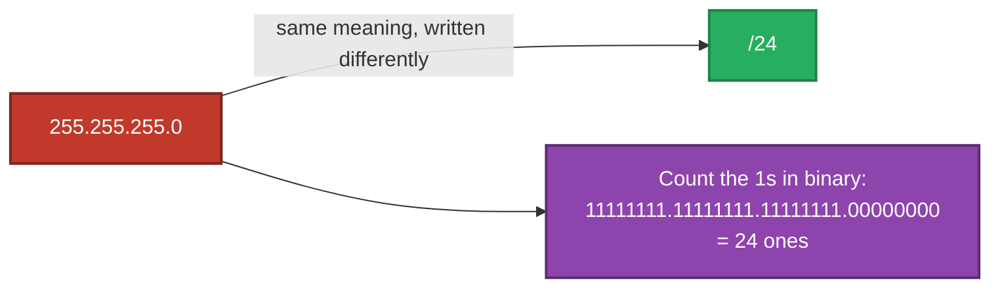
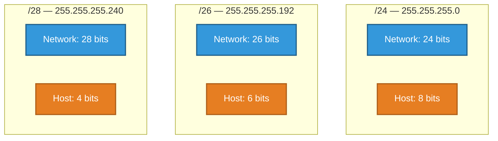
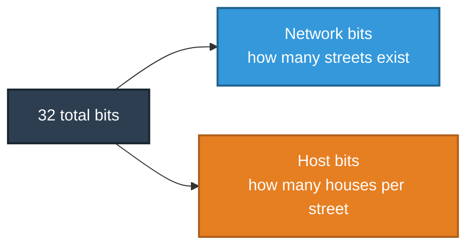
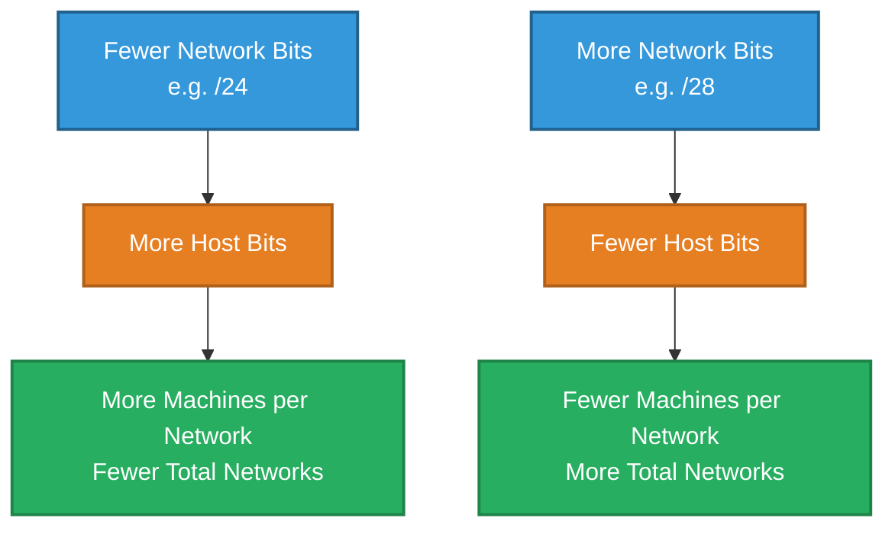
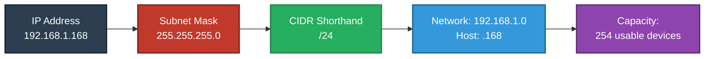

# Understanding IP Addressing & CIDR
### From Street Addresses to Network Capacity

---

## Introduction

Every device on a network — a laptop, a phone, a server — needs a unique address so that data knows where to go. This document explains how an IP address is structured, why it's split into two distinct parts, what a subnet mask like `255.255.255.0` actually means, and how that split determines exactly how many devices a given network can support.

---

## 1. The Core Idea: An IP Address is Just a Street Address

Before looking at any technical detail, it helps to start with a familiar, real-world structure: a postal address.

Consider **170 Oxford Street**. This address is not one indivisible piece of information — it naturally splits into two parts:

- **"Oxford Street"** tells the postal service *which street* to deliver to.
- **"170"** tells the delivery person *which specific house* on that street.

An IP address works in exactly the same way. It is a single number that is logically divided into two parts:

- A **network portion** — identifies *which network* a device belongs to (the "street").
- A **host portion** — identifies *which specific device* on that network (the "house number").



This single idea — **part of the address identifies the network, part identifies the device** — is the foundation for everything else in IP addressing.

---

## 2. What an IP Address Actually Is

An IPv4 address, such as `192.168.1.168`, is written as four numbers separated by dots for human readability. Underneath, it is a single **32-bit binary number**, simply split into four 8-bit groups (called **octets**).

```
192       .  168      .  1        .  168
11000000  .  10101000 .  00000001 .  10101000
```

Each octet is 8 bits long. Eight bits can represent any value from `00000000` (0) to `11111111` (255) — which is exactly why every number in an IP address always falls between 0 and 255, and never higher.



---

## 3. Splitting the Address: Network vs. Host

Just like "170 Oxford Street" splits into a street and a house number, every IP address splits into a **network portion** and a **host portion**. What determines *where* that split happens is a second 32-bit number, called the **subnet mask**.

The subnet mask uses a simple rule:

- Every bit set to **1** in the mask means "this bit belongs to the network."
- Every bit set to **0** in the mask means "this bit belongs to the host."

**Example — `192.168.1.168` with a mask of `255.255.255.0`:**

```
IP Address:    192       .168      .1        .168
Subnet Mask:   255       .255      .255      .0
In binary:     11111111  .11111111.11111111 .00000000
```

Here, the first 24 bits are all `1`s (network), and the last 8 bits are all `0`s (host).



This is exactly the same idea as "Oxford Street" (fixed, shared by every house on it) and "170" (unique to one specific house).

---

## 4. Decoding `255.255.255.0` — What This Number Actually Means

`255.255.255.0` looks arbitrary at first glance, but once translated into binary, it directly answers one question: **"how many houses share this street name?"**

Recall from Section 2 that each octet can range from 0 to 255, and that **255 in binary is `11111111`** — all eight bits switched on. So `255.255.255.0` really reads as:

```
255       . 255       . 255       . 0
11111111  . 11111111  . 11111111  . 00000000
└──────────────── network ────────────────┘ └── host ──┘
        (24 bits, all "1" — fixed)         (8 bits, all "0" — free to vary)
```

Mapped back onto the street address analogy:

| Part of the mask | Value | Street Address Meaning |
|---|---|---|
| First 24 bits | All `1`s (`255.255.255`) | "Oxford Street" — the fixed part every device on this network shares |
| Last 8 bits | All `0`s (`.0`) | The house number — the part left blank for each individual device to fill in |

**In plain terms:** `255.255.255.0` is saying *"the first three numbers of every IP address on this network are locked in place — like every house sharing the same street name — and only the last number is free to change from device to device, giving you up to 254 different 'house numbers' on this one street."*



So on a network using `192.168.1.0` with mask `255.255.255.0`, every device shares the street name `192.168.1` and simply picks a different house number from `.1` through `.254` — exactly like a row of houses all sharing "Oxford Street" but each with a different number on the door.

---

## 5. CIDR — A Shorter Way to Write the Same Mask

Writing out `255.255.255.0` every time is verbose. **CIDR notation** (Classless Inter-Domain Routing) is simply a shorthand: a forward slash followed by a count of how many `1`s appear in the mask.

```
255.255.255.0   →   24 ones   →   /24
```

So `192.168.1.168` with mask `255.255.255.0` is written far more compactly as:

```
192.168.1.168/24
```

No new concept is being introduced here — `/24` and `255.255.255.0` are two different spellings of the exact same instruction: *"the first 24 bits are the street name; the rest is the house number."*



### CIDR Lets the "Knife Line" Move

Because CIDR is just a count of bits, that count doesn't have to stop at a fixed 8, 16, or 24 — it can land anywhere. This is what makes CIDR far more flexible than fixed address classes: the boundary between "street name" and "house number" can be placed exactly where it's needed, not forced into one of three rigid sizes.



Moving the line further right (`/24` → `/26` → `/28`) creates **more, smaller streets** — more separate networks, but fewer house numbers available on each one.

---

## 6. How Many Machines Can a Network Serve?

This is where the network/host split becomes directly practical: **the number of devices a network can support is determined entirely by how many bits are given to the host portion.**

An IP address always has 32 bits in total. Whatever bits are *not* assigned to the network are automatically available for hosts — the two always add up to 32.



### The Formula

```
Usable hosts = (2 ^ number of host bits) − 2
```

Two addresses are always subtracted from the total, because they are reserved and cannot be assigned to a device:

1. **The all-zeros host address** — represents the network itself (e.g. `192.168.1.0`), not an actual device.
2. **The all-ones host address** — the **broadcast address** (e.g. `192.168.1.255`), used to reach every device on the network at once, not a specific device.

### Worked Example

For `192.168.1.168/24`:

- Network bits: 24
- Host bits: 32 − 24 = **8**
- Usable hosts: 2⁸ − 2 = 256 − 2 = **254**

Meaning "Oxford Street" (`192.168.1.0/24`) can have up to **254 houses** on it — numbered `.1` through `.254` — with `.0` reserved as the street's own identifier and `.255` reserved as the "announcement to every house" broadcast address.

---

## 7. The Trade-Off: More Streets vs. More Houses Per Street

Because the total is always fixed at 32 bits, there is a direct trade-off: **the more bits given to the network portion, the fewer remain for the host portion — and vice versa.**

| CIDR | Subnet Mask | Network Bits | Host Bits | Usable Machines `(2^host − 2)` | Typical Scale |
|---|---|---|---|---|---|
| `/8` | `255.0.0.0` | 8 | 24 | 16,777,214 | A very large organization |
| `/16` | `255.255.0.0` | 16 | 16 | 65,534 | A large campus |
| `/24` | `255.255.255.0` | 24 | 8 | 254 | A small office / home network |
| `/26` | `255.255.255.192` | 26 | 6 | 62 | A small department |
| `/28` | `255.255.255.240` | 28 | 4 | 14 | A handful of devices |
| `/30` | `255.255.255.252` | 30 | 2 | 2 | A direct link between two routers |



This relationship is **exponential, not linear** — losing just one or two host bits significantly reduces capacity, because each bit either doubles or halves the total.

**Example:** Moving from a `/24` to a `/25` removes exactly one host bit:

- `/24`: 8 host bits → 254 usable machines
- `/25`: 7 host bits → 126 usable machines

One additional network bit roughly **halved** the number of machines the network can support, while creating a second, separate network in its place.

---

## 8. Bringing It All Together

| Concept | Analogy | Technical Meaning |
|---|---|---|
| IP Address | 170 Oxford Street | A 32-bit number identifying a device on a network |
| Network Portion | "Oxford Street" | Bits that identify which network a device belongs to |
| Host Portion | "170" | Bits that identify a specific device on that network |
| Subnet Mask (`255.255.255.0`) | The line dividing street name from house number | 24 bits of `1`s locking in the "street," 8 bits of `0`s left free for the "house number" |
| CIDR Notation (`/24`) | Shorthand for the same line | A count of how many bits are locked as "network" |
| Capacity | How many houses can fit on the street | `(2 ^ host bits) − 2` = usable machines |



**In summary:** an IP address is a single fixed-size number split into two parts — one identifying the network, one identifying the device. A subnet mask like `255.255.255.0` (equivalently written as `/24` in CIDR notation) defines exactly where that split happens, and the position of that split determines how many machines a given network can support.

---

*Prepared as a technical reference document.*