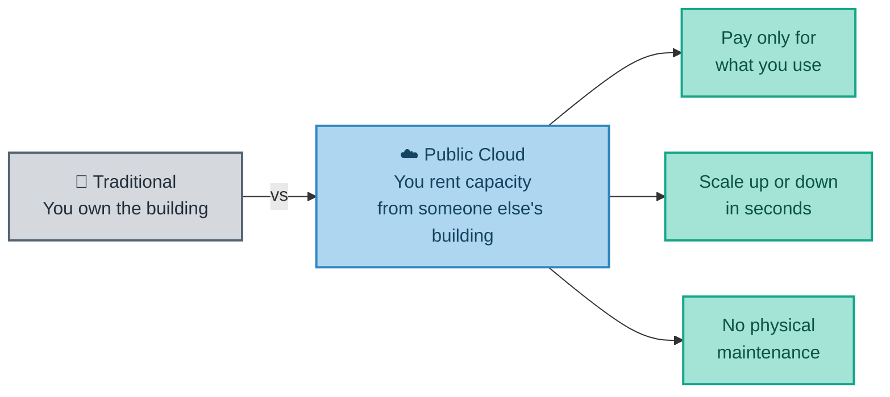
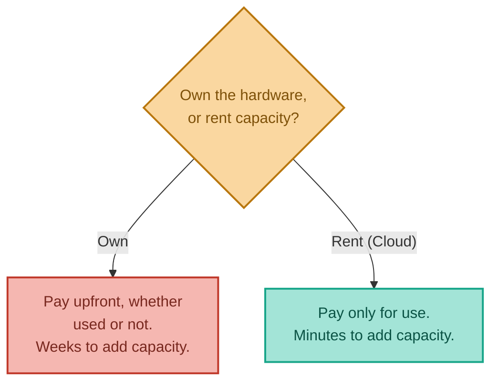
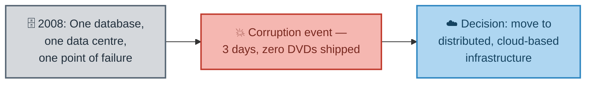
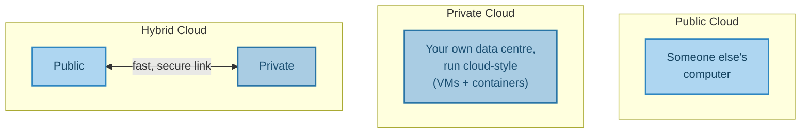
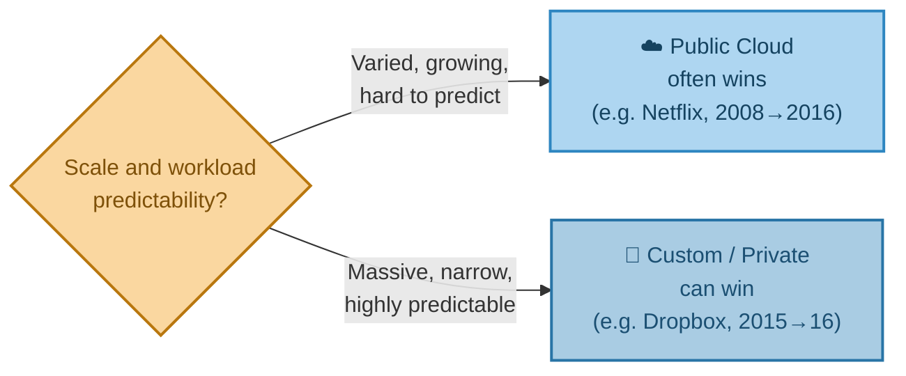

# What Is "The Cloud," Really?
### Public, Private & Hybrid Cloud

---

## Introduction

"The cloud" is one of the most-used and least-explained terms in technology. Before looking at any specific provider or service, this document answers the basic question underneath all of it: what actually *is* the cloud, why do companies choose to use it instead of running their own hardware (and why do some choose to leave it again), and what do the terms "public," "private," and "hybrid" cloud actually mean when you hear them in a meeting?

---

## 1. There Is No Cloud — It's Just Someone Else's Computer

The often-repeated joke about the cloud is also, more or less, the literal truth. Every "cloud" service — a virtual server, a database, a file store — is physical hardware sitting in a warehouse-sized building owned by a company like AWS, Microsoft, or Google. What makes it feel like "the cloud" is that you never see or touch that hardware yourself; you simply request capacity through a website, a command line, or a piece of code, and it appears within seconds.

**Real-world analogy — renting a serviced office:** You don't own the desks, the electricity supply, or the security guard downstairs. You just show up, use the space, and pay for what you use. If you need more desks next month, you don't build an extension — you just ask for more.

It's worth being precise about scale here: these aren't ordinary office server rooms. A single AWS, Azure, or Google Cloud data centre building can house hundreds of thousands of physical servers, draw as much electricity as a small city, and sit inside a security perimeter more comparable to a military installation than an office. The scale is precisely what makes the economics in the next section work.

---

## 2. Why Companies Choose Not to Run Their Own Hardware

Running your own data centre means buying servers upfront — a **capital expense** — whether you actually need them or not. Cloud flips this into a **variable expense**: you pay only for what you consume, when you consume it. There are five main reasons companies make this switch:

1. **Capital expense becomes variable expense** — no large upfront hardware purchase.
2. **Economies of scale** — a provider running millions of servers gets hardware and power far cheaper than any single company could on its own.
3. **Flexibility and elasticity** — capacity can grow or shrink to match actual demand.
4. **Speed and agility** — a new server can be provisioned in minutes, not the weeks or months it can take to procure, ship, and rack physical hardware.
5. **Let specialists run infrastructure** — a company whose "day job" is running data centres can do it better than a company whose day job is something else entirely.

**Real-world analogy — owning a car vs. using a rideshare app:** Owning a car means paying for insurance, fuel, and depreciation whether you drive it or not. A rideshare means paying only for the trip you take — and if you suddenly need five cars at once for a group, that's just as easy as needing one.

### Real-World Story: The Three Days Netflix Couldn't Ship a Single DVD

Reason 3 above — reliability, not just cost — is best illustrated by one of the most-cited origin stories in cloud computing. Netflix, in 2008, wasn't the global streaming giant it is today; it was primarily a DVD-by-mail service, and its entire operation ran on a single relational database in its own data centre.

<cite index="130-1">Netflix's journey to the cloud began in August 2008, when a major database corruption meant the company could not ship a single DVD to its members for three days.</cite> For a company whose entire business at the time *was* shipping DVDs, this was existential. <cite index="130-2">The incident made clear that Netflix needed to move away from vertically scaled single points of failure — like a relational database in one physical location — toward highly reliable, horizontally scalable, distributed systems instead.</cite> <cite index="130-3">Netflix chose AWS specifically because it offered the greatest scale and the broadest range of services available at the time.</cite>

What makes this story worth remembering isn't just that a database broke — hardware fails everywhere, constantly. It's *why* it was catastrophic: everything sat behind one system, in one place, with no independent backup path. That single-point-of-failure problem is precisely what the elasticity and redundancy described in Reason 3 above are designed to solve.

The rest of that migration — how Netflix actually *chose* to move, not just why it started — is covered in the next document, since it directly illustrates the migration strategies discussed there.

---

## 3. What You Get Beyond Just "A Server"

Beyond raw compute, cloud providers bundle in capabilities that would otherwise take a dedicated engineering team to build in-house:

- **Elastic load balancing** — automatically spreading traffic across multiple servers, so no single server gets overwhelmed while others sit idle.
- **Serverless databases, compute, and storage** — capacity that scales without you managing any underlying server at all.
- **Automatic replication across data centres** — your data quietly copied to a second location in case the first one has a problem (this is, in effect, the exact protection Netflix's 2008 database lacked).
- **Cheap, reliable high availability** — built-in resilience, without you engineering it from scratch.
- **Cheap, reliable file storage** — durable storage without buying and maintaining physical disks.

These will each get a much closer look in a later document — for now, the point is simply that "the cloud" was never just about renting a virtual machine; it's a whole toolbox of pre-built capability, and much of that toolbox exists specifically to prevent the kind of single-point-of-failure incident described above.

---

## 4. Public, Private, and Hybrid Cloud

You'll hear these three terms constantly, and they describe genuinely different setups:

- **Public Cloud** — using a cloud provider's infrastructure. This is "somebody else's computer," as in Section 1.
- **Private Cloud** — implementing cloud-style tooling (self-service virtual machines, containers) inside your **own** data centre. You get cloud convenience without giving up physical control of the hardware — often chosen for regulatory or security reasons, or, as the story below shows, for cost and performance reasons at very large scale.
- **Hybrid Cloud** — a mix of both, linked together by a fast, secure connection.

**Real-world analogy:** Public cloud is the serviced office from Section 1. Private cloud is your own building, but run with hotel-style efficiency — keycards, shared meeting rooms, on-demand desk booking. Hybrid is when a company has both an owned building *and* a serviced office, and staff move between them depending on the job.

### Real-World Story: The Company That Moved *Off* the Cloud

Netflix's story shows a company moving decisively *toward* the public cloud. Dropbox, in 2016, showed the opposite move is sometimes just as rational — and the reason why is instructive about where public cloud stops making sense.

<cite index="150-1">Dropbox was an early adopter of Amazon S3, and the service gave it the ability to scale its operations rapidly and reliably in its early years.</cite> But as Dropbox grew into one of the largest file storage services in the world, its usage pattern became narrower and more predictable than the general-purpose workloads S3 is built to serve. <cite index="147-1">Between February and October of 2015, Dropbox relocated roughly 90% of an estimated 600 petabytes of customer data into its own purpose-built network of data centres, a project it called "Magic Pocket."</cite> <cite index="145-1">Financial paperwork filed ahead of Dropbox's 2018 IPO revealed that the move cut its operating costs by roughly $75 million.</cite>

The lesson isn't "public cloud is a mistake" — Dropbox's own engineers were explicit that AWS had been essential to their early growth. The lesson is closer to what Reason 2 in Section 2 already hinted at: economies of scale cut both ways. A generic public cloud service has to be efficient for *every* customer's wildly different workload. Once a single company's usage becomes large enough and narrow enough, building infrastructure custom-fit to exactly that one use case can beat what even the biggest public cloud provider can offer. This is precisely why the *hybrid* option exists as a genuine middle ground, not just a temporary stepping stone on the way to "fully public."

Why would a company keep anything on private infrastructure at all, rather than moving everything to public cloud? Beyond the scale argument above, two other reasons come up again and again: **regulatory compliance** (some data legally cannot leave a specific jurisdiction or type of facility) and **security requirements** (some workloads are considered too sensitive to sit on shared infrastructure). Hybrid cloud is, in practice, where most large enterprises sit today — not because public cloud isn't capable enough, but because moving *everything* isn't always possible, or, as Dropbox found, always the cheapest option once you're operating at sufficient scale.

---

## 5. Bringing It All Together

| Concept | Real-World Analogy | Technical Meaning |
|---|---|---|
| The Cloud | A serviced office | Renting compute/storage from someone else's data centre |
| Capex → Opex | Owning vs. renting a car | Paying only for what's used, rather than a large upfront purchase |
| Public Cloud | The serviced office itself | Using a provider's shared infrastructure |
| Private Cloud | Your own building, run hotel-style | Cloud-style tooling inside your own data centre |
| Hybrid Cloud | Owning a building *and* renting an office | Public and private cloud, linked together |
| Netflix, 2008–2016 | Rebuilding after a single point of failure | Moving *toward* public cloud for reliability and elasticity |
| Dropbox, 2015–2016 | Building custom-fit infrastructure at scale | Moving *away* from public cloud once usage became large and predictable enough |

**In summary:** the cloud isn't a mysterious, ethereal thing — it's physical hardware in someone else's data centre, made accessible on demand, at a scale most companies could never justify building themselves. Companies adopt it to turn a large upfront hardware cost into a flexible, pay-as-you-go expense, to gain speed and elasticity, and — as Netflix's 2008 database corruption showed in the starkest possible terms — to escape the kind of single point of failure that can stop a business in its tracks. But as Dropbox later demonstrated, the public cloud isn't automatically the final destination for every company forever; at sufficient scale, with a narrow enough workload, building custom infrastructure can still win. Public, private, and hybrid cloud describe different ways of drawing that line between "our own hardware" and "someone else's" — and for most large organisations today, that line runs somewhere in the middle, and can move in either direction as circumstances change.

---

*Prepared as a technical reference document.*