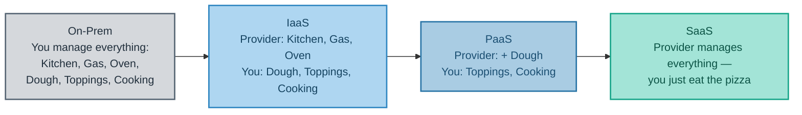
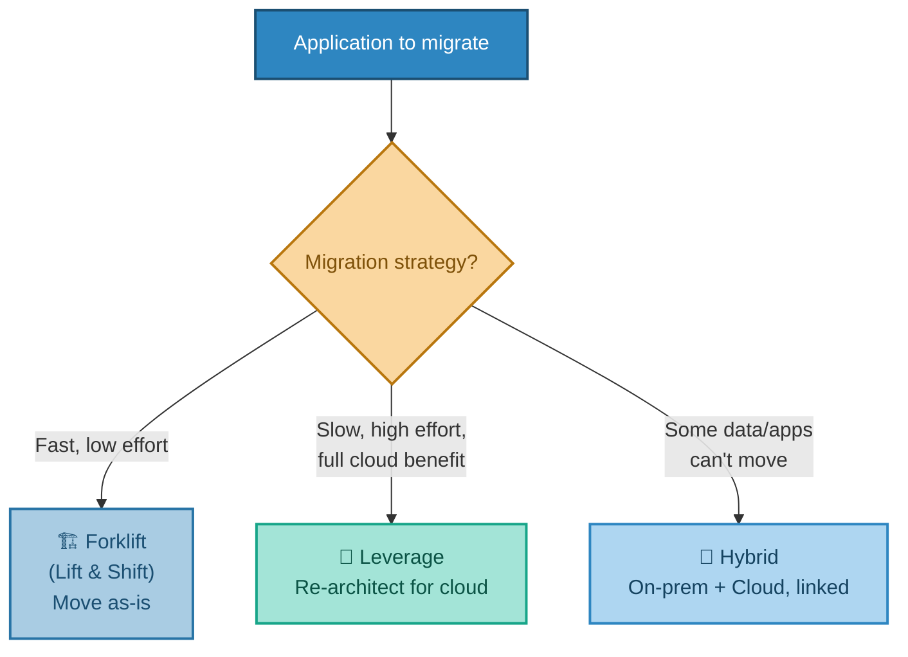
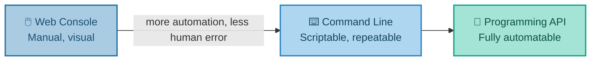

# Choosing How Much You Manage
### Service Models & Migration Strategies

---

## Introduction

Once a company has decided to use the cloud, two big decisions remain: **how much of the technology stack should the provider manage, versus you?** And **how should existing applications actually get there?** This document covers both — the IaaS/PaaS/SaaS service models (explained through a pizza analogy that tends to stick permanently once heard), and the main strategies companies use to migrate existing systems into the cloud.

---

## 1. Infrastructure, Platform, or Software — "As a Service"

You'll frequently hear three terms describing how much of the technical stack a cloud provider manages on your behalf:

- **IaaS (Infrastructure as a Service):** the provider gives you the raw infrastructure — compute, network, storage — and you install and run everything else yourself.
- **PaaS (Platform as a Service):** the provider also manages the runtime and platform — you just deploy your application code.
- **SaaS (Software as a Service):** the provider manages everything — you just use the finished product (think Gmail or Salesforce).

**Real-world analogy — ordering pizza:**

- **Made In-House:** you own the kitchen, buy the ingredients, and cook the pizza yourself.
- **IaaS — "Kitchen as a Service":** someone provides the kitchen, oven, and gas — you bring the dough, toppings, and do the cooking.
- **PaaS — "Walk-in-and-Bake":** someone provides the kitchen *and* the dough — you just add toppings and cook.
- **SaaS — "Pizza as a Service":** someone hands you a finished, cooked pizza. You just eat it.

A quick real-world mapping, so this isn't just theory: EC2 is IaaS. A managed application platform like Elastic Beanstalk is PaaS. Office 365 or Gmail is SaaS. And somewhere beyond even PaaS sits **serverless** (sometimes called **FaaS — Function as a Service**), where you don't manage a server *or* a runtime — just a function that runs when triggered. This gets its own closer look in a later document.

---

## 2. Getting Existing Applications Into the Cloud

Deciding *what* the cloud offers is only half the picture. Companies with existing, running applications also have to decide *how* to actually get them there. There are three common approaches:

### All In and Forklift ("Lift and Shift")

Move applications to the cloud exactly as they are, with minimal change.

- **Pros:** relatively easy and quick to do; doesn't require much cloud-specific knowledge.
- **Cons:** you're not benefiting fully from what the cloud platform can actually do — you're effectively just renting a server instead of owning one.

### All In and Leverage

Re-architect the application to genuinely take advantage of cloud-native services — managed databases, auto-scaling, serverless components, and so on.

- **Pros:** full benefit of the cloud platform's capabilities.
- **Cons:** more complex, and more expense upfront.

### Hybrid Architecture

Some applications and data simply cannot move to the cloud — often due to regulatory compliance or security requirements — so they stay on-premises, while everything else moves, connected by a fast, secure link.

**Real-world analogy — moving house:**

- **Forklift** = pack every box exactly as-is and put it in the new house, even if the furniture doesn't really suit the new floor plan.
- **Leverage** = redesign the furniture layout (maybe buy new furniture entirely) to actually suit the new house properly.
- **Hybrid** = some things — like a piano bolted to the old floor — simply can't move, so you keep a foot in both houses.

None of these three is universally "correct" — the right choice depends entirely on how much time, budget, and cloud expertise is available, and how much of the platform's benefit is actually needed.

---

## 3. Who Provides All This?

Three providers dominate the public cloud market:

- **Amazon Web Services (AWS)** — the market leader and pioneer of cloud.
- **Microsoft Azure** — the second largest, with the built-in advantage that nearly every organisation in the world is already a Microsoft customer in some form.
- **Google Cloud** — smaller, but widely seen as closing the gap with AWS and Azure.

The underlying concepts covered across this whole series apply to all three — only the specific service names differ. Where useful, later documents will point out the equivalent service on each platform.

---

## 4. How You Actually Interact With the Cloud

Cloud providers offer three main ways of working with their platform:

- **Web console** — a graphical interface for exploring and managing resources by hand.
- **Command line tools** — everything doable in the console can also be scripted via PowerShell, shell scripts, or a command prompt.
- **Programming APIs** — code libraries (SDKs) that let developers control the platform directly from their own applications.

**Real-world analogy:** The console is like driving a car manually — fine for a Sunday drive, but risky at scale. The CLI and API are like cruise control or autopilot: repeatable, less error-prone, and able to scale to a whole fleet of cars (servers) at once, not just one.

**Why this matters in practice:** relying on humans clicking through a console at scale reliably produces "fat finger" errors — genuine, well-documented incidents exist of a single misclick sending a company's stock price swinging within seconds. Automation isn't just a nice-to-have; it's what makes cloud infrastructure safe to operate at any real scale.

---

## 5. Bringing It All Together

| Concept | Real-World Analogy | Technical Meaning |
|---|---|---|
| IaaS | Kitchen as a Service | Provider manages infrastructure; you manage everything else |
| PaaS | Walk-in-and-Bake | Provider also manages the runtime/platform |
| SaaS | Pizza as a Service | Provider manages the entire finished product |
| Forklift Migration | Moving house, packing boxes as-is | Moving applications unchanged into the cloud |
| Leverage Migration | Redesigning furniture for the new house | Re-architecting to use cloud-native services fully |
| Hybrid Migration | Keeping a piano that can't be moved | Some apps/data stay on-prem, linked to the cloud |
| Console vs. CLI/API | Manual driving vs. autopilot | Manual clicking vs. scriptable, repeatable automation |

**In summary:** IaaS, PaaS, and SaaS describe a sliding scale of how much of the technology stack a provider manages for you, from "just the kitchen" to "a finished pizza." Migrating existing systems into the cloud generally follows one of three strategies — quick-and-simple Forklift, fuller-benefit Leverage, or a Hybrid mix where some things simply can't move — and once there, interacting with the cloud through scriptable tools rather than manual console clicks is what keeps operations safe and repeatable at scale.

---

*Prepared as a technical reference document.*
