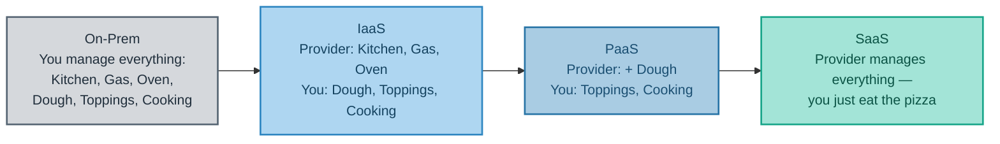
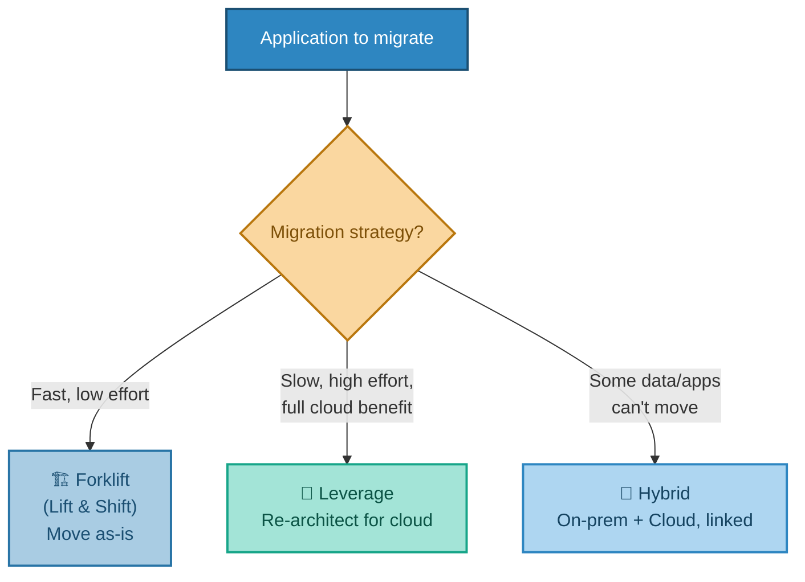
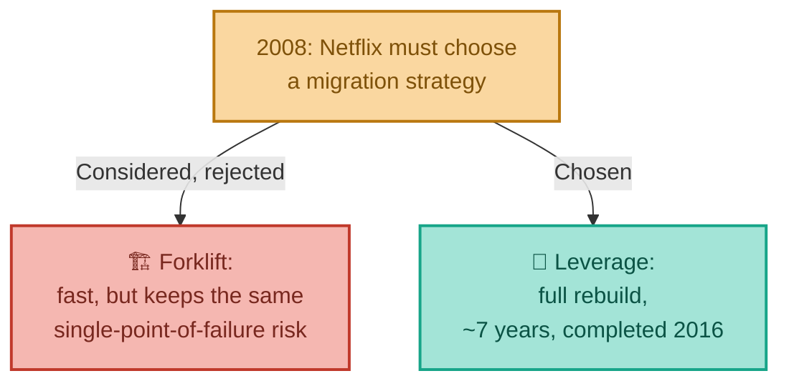
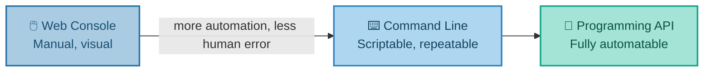

# Choosing How Much You Manage
### Service Models & Migration Strategies

---

## Introduction

Once a company has decided to use the cloud, two big decisions remain: **how much of the technology stack should the provider manage, versus you?** And **how should existing applications actually get there?** This document covers both — the IaaS/PaaS/SaaS service models (explained through a pizza analogy that tends to stick permanently once heard), and the main strategies companies use to migrate existing systems into the cloud, illustrated by the same Netflix migration introduced in the previous document.

---

## 1. Infrastructure, Platform, or Software — "As a Service"

You'll frequently hear three terms describing how much of the technical stack a cloud provider manages on your behalf:

- **IaaS (Infrastructure as a Service):** the provider gives you the raw infrastructure — compute, network, storage — and you install and run everything else yourself.
- **PaaS (Platform as a Service):** the provider also manages the runtime and platform — you just deploy your application code.
- **SaaS (Software as a Service):** the provider manages everything — you just use the finished product (think Gmail or Salesforce).

**Real-world analogy — ordering pizza:**

- **Made In-House:** you own the kitchen, buy the ingredients, and cook the pizza yourself.
- **IaaS — "Kitchen as a Service":** someone provides the kitchen, oven, and gas — you bring the dough, toppings, and do the cooking.
- **PaaS — "Walk-in-and-Bake":** someone provides the kitchen *and* the dough — you just add toppings and cook.
- **SaaS — "Pizza as a Service":** someone hands you a finished, cooked pizza. You just eat it.

A quick real-world mapping, so this isn't just theory: EC2 is IaaS. A managed application platform like Elastic Beanstalk is PaaS. Office 365 or Gmail is SaaS. And somewhere beyond even PaaS sits **serverless** (sometimes called **FaaS — Function as a Service**), where you don't manage a server *or* a runtime — just a function that runs when triggered. This gets its own closer look in a later document.

It's worth noticing something these four levels have in common: at every step up this ladder, you trade *control* for *convenience*. Running everything on-prem gives you total control over every layer, at the cost of managing every layer yourself. SaaS gives you almost no control — you can't tweak Gmail's underlying server configuration — in exchange for needing to think about infrastructure at all. Most real organisations don't pick one level for everything; they mix and match depending on what a given application actually needs.

---

## 2. Getting Existing Applications Into the Cloud

Deciding *what* the cloud offers is only half the picture. Companies with existing, running applications also have to decide *how* to actually get them there. There are three common approaches:

### All In and Forklift ("Lift and Shift")

Move applications to the cloud exactly as they are, with minimal change.

- **Pros:** relatively easy and quick to do; doesn't require much cloud-specific knowledge.
- **Cons:** you're not benefiting fully from what the cloud platform can actually do — you're effectively just renting a server instead of owning one.

### All In and Leverage

Re-architect the application to genuinely take advantage of cloud-native services — managed databases, auto-scaling, serverless components, and so on.

- **Pros:** full benefit of the cloud platform's capabilities.
- **Cons:** more complex, and more expense upfront.

### Hybrid Architecture

Some applications and data simply cannot move to the cloud — often due to regulatory compliance or security requirements — so they stay on-premises, while everything else moves, connected by a fast, secure link.

**Real-world analogy — moving house:**

- **Forklift** = pack every box exactly as-is and put it in the new house, even if the furniture doesn't really suit the new floor plan.
- **Leverage** = redesign the furniture layout (maybe buy new furniture entirely) to actually suit the new house properly.
- **Hybrid** = some things — like a piano bolted to the old floor — simply can't move, so you keep a foot in both houses.

### Real-World Story: Netflix's Choice — Forklift, or Rebuild From Scratch?

The previous document introduced *why* Netflix moved to AWS: a 2008 database corruption that halted DVD shipments for three days. What it didn't cover was *how* — and Netflix's engineering team was remarkably candid about the choice they faced, because it maps almost exactly onto the three strategies above.

The obvious, fastest option was Forklift: pack up the existing systems as-is and drop them onto AWS virtual servers. <cite index="128-5">Netflix's own engineers acknowledged that the easiest way to move to the cloud is to forklift every system, unchanged, straight out of the data centre and onto AWS.</cite> But they also identified the trap in that approach: <cite index="128-6">doing so simply carries every existing problem and limitation of the old data centre along with it, unsolved.</cite> Since the entire point of moving was to escape the single-point-of-failure design that caused the 2008 outage, a Forklift migration would have technically succeeded while leaving the actual underlying risk completely intact.

<cite index="128-7">Instead, Netflix deliberately chose the cloud-native, Leverage approach — rebuilding virtually all of its technology and fundamentally changing how the company operated, rather than simply relocating it.</cite> This is why the migration took as long as it did: not a lift-and-shift weekend project, but a genuine architectural rebuild, spread out over roughly seven years, with the majority of customer-facing systems moved before 2015 and the last remaining data-centre infrastructure — the billing systems — finally retired in <cite index="130-4">early January 2016</cite>.

The takeaway isn't that Leverage is always the "correct" choice — for many companies, with less catastrophic motivation and a tighter budget, Forklift is a perfectly sensible first step, and plenty of successful migrations start there before gradually re-architecting piece by piece afterward. Netflix's case is instructive specifically *because* their original problem was architectural, not just physical — no amount of relocating an unchanged single-database design would have fixed the flaw that broke it in the first place.

None of these three strategies is universally "correct" — the right choice depends entirely on how much time, budget, and cloud expertise is available, and how much of the platform's benefit is actually needed.

---

## 3. Who Provides All This?

Three providers dominate the public cloud market:

- **Amazon Web Services (AWS)** — the market leader and pioneer of cloud.
- **Microsoft Azure** — the second largest, with the built-in advantage that nearly every organisation in the world is already a Microsoft customer in some form.
- **Google Cloud** — smaller, but widely seen as closing the gap with AWS and Azure.

The underlying concepts covered across this whole series apply to all three — only the specific service names differ. Where useful, later documents will point out the equivalent service on each platform.

---

## 4. How You Actually Interact With the Cloud

Cloud providers offer three main ways of working with their platform:

- **Web console** — a graphical interface for exploring and managing resources by hand.
- **Command line tools** — everything doable in the console can also be scripted via PowerShell, shell scripts, or a command prompt.
- **Programming APIs** — code libraries (SDKs) that let developers control the platform directly from their own applications.

**Real-world analogy:** The console is like driving a car manually — fine for a Sunday drive, but risky at scale. The CLI and API are like cruise control or autopilot: repeatable, less error-prone, and able to scale to a whole fleet of cars (servers) at once, not just one.

**Why this matters in practice:** relying on humans clicking through a console at scale reliably produces "fat finger" errors — genuine, well-documented incidents exist of a single misclick sending a company's stock price swinging within seconds. Automation isn't just a nice-to-have; it's what makes cloud infrastructure safe to operate at any real scale. The next document's real-world story — a single mistyped command that took down a large slice of the internet in 2017 — makes exactly this point, from the cloud provider's own side of the relationship.

---

## 5. Bringing It All Together

| Concept | Real-World Analogy | Technical Meaning |
|---|---|---|
| IaaS | Kitchen as a Service | Provider manages infrastructure; you manage everything else |
| PaaS | Walk-in-and-Bake | Provider also manages the runtime/platform |
| SaaS | Pizza as a Service | Provider manages the entire finished product |
| Forklift Migration | Moving house, packing boxes as-is | Moving applications unchanged into the cloud |
| Leverage Migration | Redesigning furniture for the new house | Re-architecting to use cloud-native services fully |
| Hybrid Migration | Keeping a piano that can't be moved | Some apps/data stay on-prem, linked to the cloud |
| Console vs. CLI/API | Manual driving vs. autopilot | Manual clicking vs. scriptable, repeatable automation |
| Netflix, 2008–2016 | Rebuilding the house rather than moving the old furniture in | Rejecting Forklift in favour of a full Leverage rebuild |

**In summary:** IaaS, PaaS, and SaaS describe a sliding scale of how much of the technology stack a provider manages for you, from "just the kitchen" to "a finished pizza" — and moving up that scale trades control for convenience. Migrating existing systems into the cloud generally follows one of three strategies — quick-and-simple Forklift, fuller-benefit Leverage, or a Hybrid mix where some things simply can't move — and Netflix's own migration shows exactly why the choice matters: a Forklift move would have relocated their 2008 database problem to AWS unchanged, while the Leverage rebuild they actually chose took roughly seven years but solved the underlying architectural flaw for good. Once in the cloud, interacting with it through scriptable tools rather than manual console clicks is what keeps operations safe and repeatable at scale.

---

*Prepared as a technical reference document.*