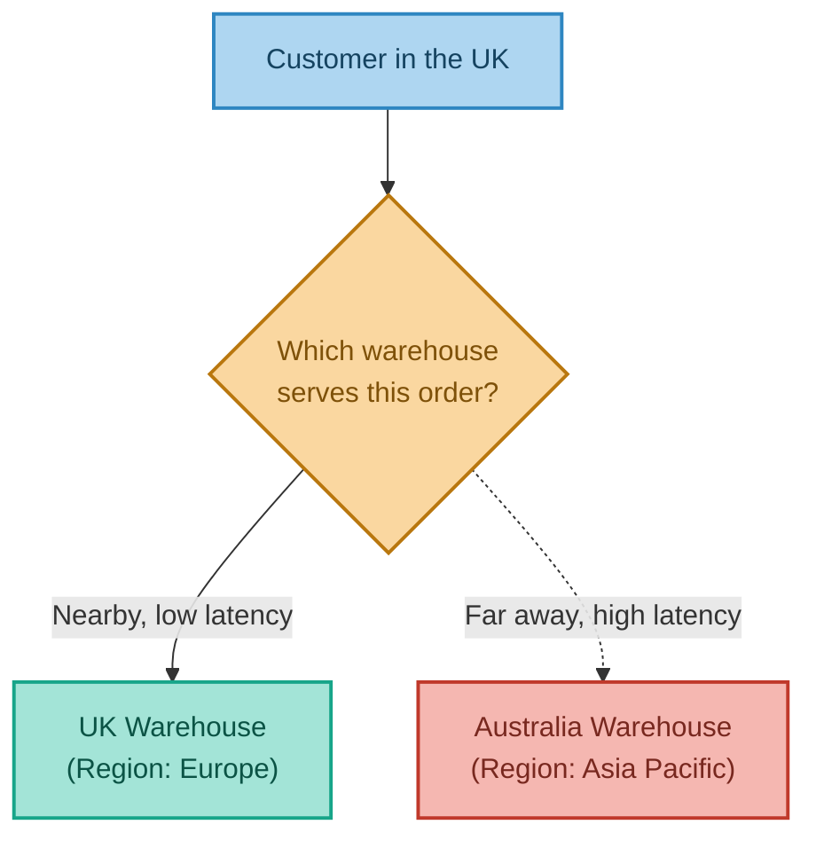
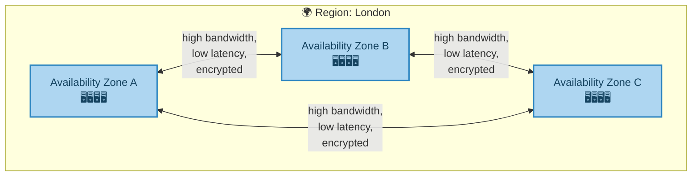
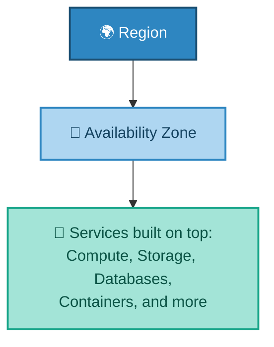
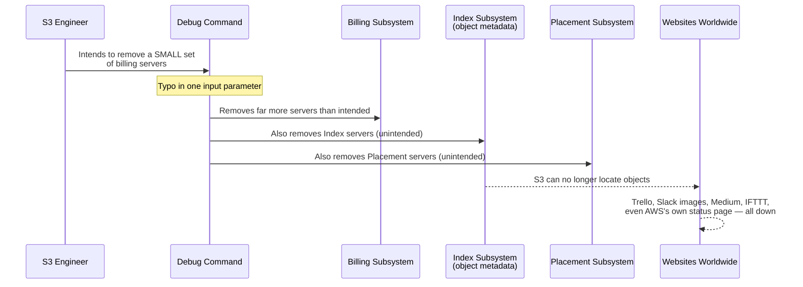
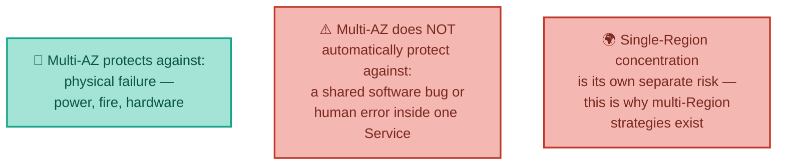

# Where Does the Cloud Actually Live?
### Regions, Availability Zones & Services

---

## Introduction

"The cloud" is physical hardware, which means it has to physically exist *somewhere*. This document explains how cloud providers organise their global infrastructure into **Regions** and **Availability Zones**, introduces the concept of a **Service** — the actual, named products (like a database or a storage system) that get built on top of that physical foundation — and closes with one of the most instructive outages in cloud computing history, which shows exactly what happens when this structure isn't respected.

---

## 1. Regions — Choosing a Part of the World

A **Region** is a distinct geographic area where a cloud provider operates data centres — for example, "Europe (London)" or "Asia Pacific (Singapore)." Providers maintain dozens of these worldwide.

When you launch a cloud resource, you choose a Region for it, and that determines where physically your data and servers actually live. This choice matters for two practical reasons:

- **Latency** — a region physically closer to your users generally means faster response times.
- **Data residency and regulation** — some legal requirements mandate that certain data (e.g. relating to EU citizens) must stay within a specific geographic or legal boundary.

**Real-world analogy:** A global supermarket chain doesn't ship every order from one giant warehouse — it maintains regional distribution centres, so a customer in London gets their order from a UK warehouse, not one in Australia. Choosing a Region is choosing which warehouse serves you.

There's a third, less obvious reason Region choice matters, which the story at the end of this document illustrates directly: **concentration risk**. Some regions — because they were launched first, or because a critical mass of customers built there early and never moved — end up hosting a disproportionate share of the internet's infrastructure. AWS's very first region, US-EAST-1 in Northern Virginia, is the clearest example of this in the industry, and it's worth keeping in mind as you read Section 4.

---

## 2. Availability Zones — Not Putting All Your Eggs in One Basket

Each Region is itself made up of **2 to 6 Availability Zones (AZs)** — physically separate data centres (or clusters of them), connected to one another by high-bandwidth, low-latency, encrypted links.

AZs exist so that a single point of failure — a fire, a power outage, or a flood at one data centre — doesn't take down an entire application. By spreading servers across multiple AZs within the same Region, you get real resilience, without the latency penalty of spreading across the entire world.

**Real-world analogy — a city with several hospitals rather than one giant hospital:** If one hospital loses power, patients can still be treated at the others. Because they're all in the same city, moving between them (like data moving between AZs) takes minutes, not days.

This structure — Region, made up of AZs, each containing physical servers — is the foundation everything else in the cloud is built on top of. Every service discussed in the next document (virtual servers, storage, databases) ultimately runs inside an Availability Zone, inside a Region.

It's important to be precise about what multi-AZ redundancy actually protects against, and what it doesn't. Spreading your own servers across AZs genuinely protects you against a *physical* failure — a power cut, a hardware fault, a fire — hitting one specific building. What it does **not** automatically protect you against is a failure inside a *shared software system* that multiple AZs, or the whole Region, both depend on. That distinction is exactly what the story below is about.

---

## 3. Services — What Actually Gets Built on Top

On top of Regions and AZs, providers offer hundreds of named **Services**. AWS, for example, launched in 2006 with just three services and now offers hundreds more — and this number has grown continuously ever since.

The same underlying *capability* usually exists on every major provider, just under a different name:

| Capability | AWS | Azure | Google Cloud |
|---|---|---|---|
| Running Servers | EC2 | Virtual Machines | Compute Engine |
| Storage | S3 | Azure Blob Storage | Google Cloud Storage |
| Databases | RDS / DynamoDB | SQL Managed Instances | Cloud SQL |
| Containers | Elastic Container Service | Azure Container Service | Google Kubernetes Engine |

One detail worth sitting with: a Service like S3 is not simply "duplicated" identically and independently across every AZ in a Region the way the diagram above might suggest. In reality, a Service is itself a large, complex distributed software system, with its own internal subsystems, that happens to *run* across multiple AZs for resilience. Those internal subsystems can still, in principle, share a single point of failure — even while the physical servers underneath them are spread across separate buildings. This is precisely the mechanism behind the story below.

---

## 4. Real-World Story: The Typo That Took Down a Meaningful Slice of the Internet

On the morning of 28 February 2017, a huge number of unrelated websites — far more than most people would guess relied on a single company at all — simultaneously broke.

<cite index="144-2">Amazon's own S3 team was in the middle of debugging an unrelated issue: the S3 billing system was processing more slowly than expected.</cite> <cite index="144-3">At 9:37 AM Pacific time, an authorised S3 team member, following an established playbook, ran a command intended to remove a small number of servers from one of the billing subsystems.</cite> <cite index="144-4">One of the inputs to that command was entered incorrectly, and a far larger set of servers was removed than intended.</cite> <cite index="144-5">Critically, the servers that were mistakenly removed also supported two entirely different S3 subsystems, unrelated to billing</cite> — including, as AWS's own post-incident report explained, the index subsystem responsible for tracking the metadata and location of every single object stored in S3 across the whole US-EAST-1 Region.

The consequences cascaded far beyond AWS's own dashboard. <cite index="140-3">Within minutes, Slack workspaces stopped loading images, Trello boards went blank, Medium articles refused to render, and even smart lightbulbs from companies like LIFX became unreachable — and, most tellingly, Amazon's own service health dashboard couldn't update either, because it depended on the very same broken system it was meant to be reporting on.</cite> The outage lasted for roughly four hours before S3 was fully restored.

**Why this belongs in a document about Regions and Availability Zones, specifically:** this wasn't a story about one data centre losing power while its neighbours kept running smoothly — the exact scenario multi-AZ design protects against, described in Section 2. It was a single mistyped command, inside one *shared service*, that happened to affect subsystems spanning the Region. No amount of physically separating servers into different buildings would have stopped it, because the failure wasn't physical — it was a single human input error inside software that many things, including AWS's own monitoring tools, depended on completely.

The concentration-risk point from Section 1 also matters here: this incident hit US-EAST-1 specifically — AWS's oldest, largest, and most heavily used Region, the one countless companies defaulted into simply because it was the first one that ever existed. A huge fraction of "the internet," in practice, still runs there today. Following this incident, AWS made several changes publicly documented in its own post-mortem: adding safeguards to prevent that class of command from ever removing too many servers again, redesigning the recovery process to restart faster, and — pointedly — moving its own status dashboard so it no longer depended on the exact system it exists to monitor.

---

## 5. Bringing It All Together

| Concept | Real-World Analogy | Technical Meaning |
|---|---|---|
| Region | A part of the world (e.g. Europe) | A distinct geographic area with its own data centres |
| Availability Zone | A hospital within a city | A physically separate data centre within a Region |
| Multi-AZ resilience | A city with several hospitals | Spreading resources so one facility's failure doesn't cause an outage |
| Service | A specific department within the hospital | A named, usable product built on top of the physical infrastructure |
| The 2017 S3 Outage | A single wrong instruction to hospital admin staff, affecting every ward at once | A shared-software failure that multi-AZ design alone couldn't prevent |

**In summary:** cloud infrastructure is organised as a hierarchy — Regions represent broad geographic choices (driven by latency, regulation, and, as the story above shows, concentration risk), each Region contains multiple Availability Zones for physical resilience, and Services are the actual named products — virtual servers, storage, databases — that get built on top of that foundation. The 2017 S3 outage is the sharpest possible illustration of where this structure's protection ends: spreading servers across AZs defends against physical failure, but a single human error inside a shared software system can still cascade across an entire Region regardless — which is exactly why, at the largest scale, some organisations go a step further and design for failure across entire Regions, not just within them.

---

*Prepared as a technical reference document.*