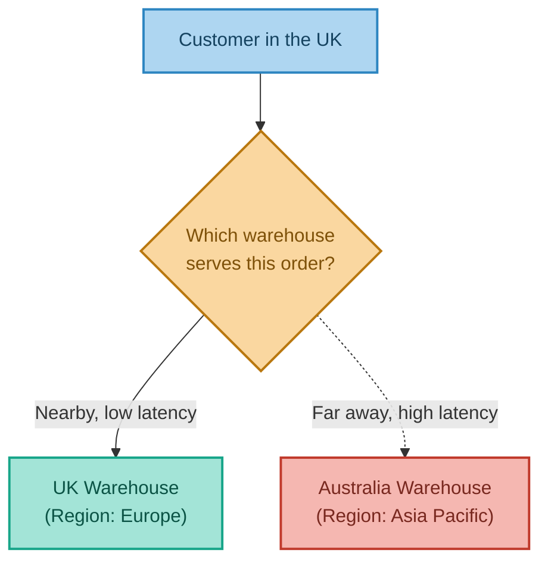
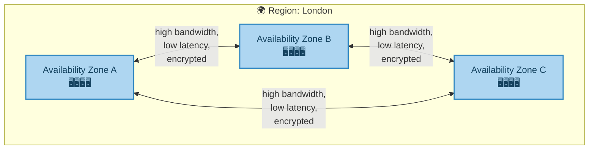
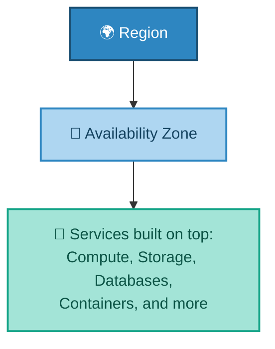

# Where Does the Cloud Actually Live?
### Regions, Availability Zones & Services

---

## Introduction

"The cloud" is physical hardware, which means it has to physically exist *somewhere*. This document explains how cloud providers organise their global infrastructure into **Regions** and **Availability Zones**, and introduces the concept of a **Service** — the actual, named products (like a database or a storage system) that get built on top of that physical foundation.

---

## 1. Regions — Choosing a Part of the World

A **Region** is a distinct geographic area where a cloud provider operates data centres — for example, "Europe (London)" or "Asia Pacific (Singapore)." Providers maintain dozens of these worldwide.

When you launch a cloud resource, you choose a Region for it, and that determines where physically your data and servers actually live. This choice matters for two practical reasons:

- **Latency** — a region physically closer to your users generally means faster response times.
- **Data residency and regulation** — some legal requirements mandate that certain data (e.g. relating to EU citizens) must stay within a specific geographic or legal boundary.

**Real-world analogy:** A global supermarket chain doesn't ship every order from one giant warehouse — it maintains regional distribution centres, so a customer in London gets their order from a UK warehouse, not one in Australia. Choosing a Region is choosing which warehouse serves you.

---

## 2. Availability Zones — Not Putting All Your Eggs in One Basket

Each Region is itself made up of **2 to 6 Availability Zones (AZs)** — physically separate data centres (or clusters of them), connected to one another by high-bandwidth, low-latency, encrypted links.

AZs exist so that a single point of failure — a fire, a power outage, or a flood at one data centre — doesn't take down an entire application. By spreading servers across multiple AZs within the same Region, you get real resilience, without the latency penalty of spreading across the entire world.

**Real-world analogy — a city with several hospitals rather than one giant hospital:** If one hospital loses power, patients can still be treated at the others. Because they're all in the same city, moving between them (like data moving between AZs) takes minutes, not days.

This structure — Region, made up of AZs, each containing physical servers — is the foundation everything else in the cloud is built on top of. Every service discussed in the next document (virtual servers, storage, databases) ultimately runs inside an Availability Zone, inside a Region.

---

## 3. Services — What Actually Gets Built on Top

On top of Regions and AZs, providers offer hundreds of named **Services**. AWS, for example, launched in 2006 with just three services and now offers hundreds more — and this number has grown continuously ever since.

The same underlying *capability* usually exists on every major provider, just under a different name:

| Capability | AWS | Azure | Google Cloud |
|---|---|---|---|
| Running Servers | EC2 | Virtual Machines | Compute Engine |
| Storage | S3 | Azure Blob Storage | Google Cloud Storage |
| Databases | RDS / DynamoDB | SQL Managed Instances | Cloud SQL |
| Containers | Elastic Container Service | Azure Container Service | Google Kubernetes Engine |

The next document in this series looks closely at the most commonly used compute, storage, and database services — using AWS as the running example, while noting the equivalent service on other providers along the way.

---

## 4. Bringing It All Together

| Concept | Real-World Analogy | Technical Meaning |
|---|---|---|
| Region | A part of the world (e.g. Europe) | A distinct geographic area with its own data centres |
| Availability Zone | A hospital within a city | A physically separate data centre within a Region |
| Multi-AZ resilience | A city with several hospitals | Spreading resources so one facility's failure doesn't cause an outage |
| Service | A specific department within the hospital | A named, usable product built on top of the physical infrastructure |

**In summary:** cloud infrastructure is organised as a hierarchy — Regions represent broad geographic choices (driven by latency and regulation), each Region contains multiple Availability Zones for physical resilience, and Services are the actual named products — virtual servers, storage, databases — that get built on top of that foundation. Understanding this structure is what makes the rest of the cloud's services make sense, since every one of them ultimately runs somewhere inside this same Region → AZ hierarchy.

---

*Prepared as a technical reference document.*
