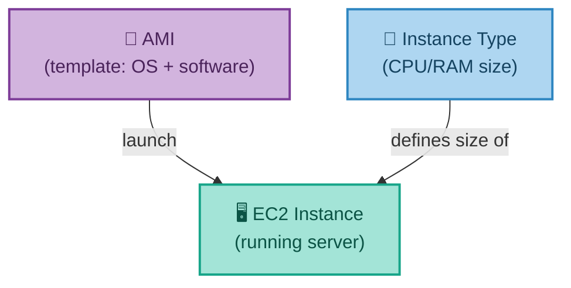
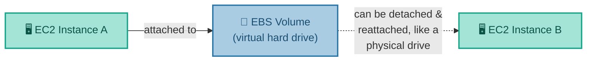
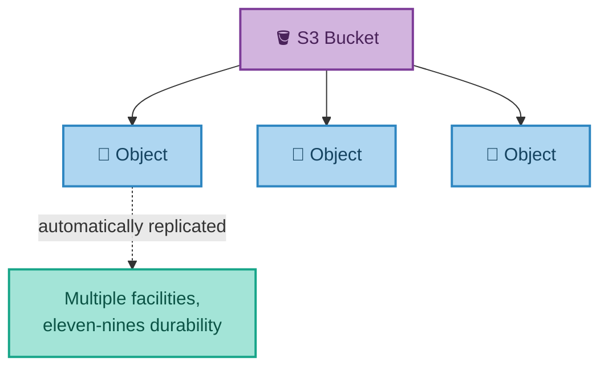
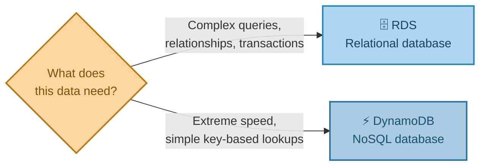
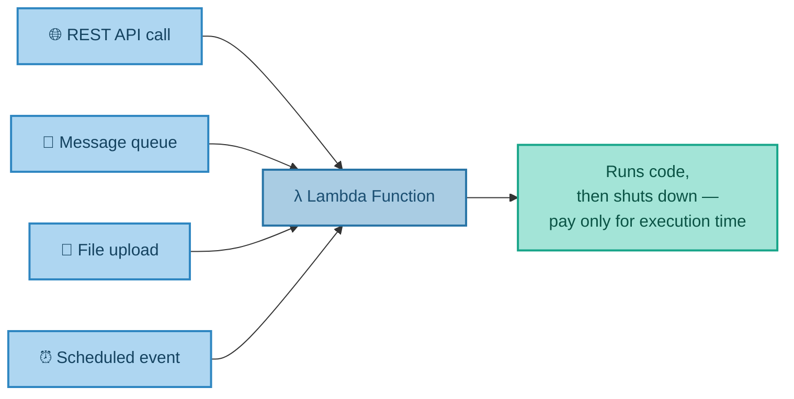

# Building Blocks: Compute, Storage & Databases
### EC2, S3, RDS, DynamoDB & Serverless

---

## Introduction

With Regions, Availability Zones, and the concept of a Service established, this document looks closely at the specific services most commonly used to actually build something in the cloud: virtual servers, storage, and databases — using AWS as the running example throughout, since the concepts transfer directly to every other provider.

---

## 1. Running Servers — EC2, AMIs, and Instance Types

**EC2 (Elastic Compute Cloud)** is AWS's virtual server service. A running EC2 server is called an **instance**, launched from a template called an **AMI (Amazon Machine Image)**, using a chosen **instance type** — the size of the machine, in terms of CPU and memory.

**Real-world analogy — ordering a custom laptop online:** The **AMI** is the pre-installed software image (which operating system, which applications). The **instance type** is the spec sheet you choose (8GB RAM vs. 32GB RAM, 2 cores vs. 8 cores).

AMIs can come from several sources: standard Linux/Windows images provided by the platform itself, third-party images from a Marketplace, or images you build yourself.

### Hard Drives — EBS

EC2 servers use **EBS (Elastic Block Store)** volumes for storage — virtual hard drives that behave much like physical ones. They can be magnetic or solid-state, provisioned with a minimum read/write speed, and — just like a physical drive — detached from one instance and reattached to a different one.

---

## 2. Data Storage — Choosing the Right Tool for the Job

No single storage type suits every need — a technique often called **polyglot persistence**. A shopping cart needs millisecond-fast lookups; a finance report needs relational joins and transactions; a decade-old compliance record just needs to sit somewhere cheap and safe until it's needed. AWS alone offers several distinct storage services, each suited to a different job — including EBS (covered above), Instance Store (temporary SSD storage attached directly to an instance), ElastiCache (Memcached/Redis as a managed service), and the object storage and database services covered in detail below.

### S3 — Simple Storage Service

**S3** is a file storage service accessed over HTTP/S. Files are called **objects**, and objects are stored in **buckets**. It offers extraordinarily high durability — **99.999999999%** (informally, "eleven nines") — meaning the mathematical probability of ever losing a stored file is astronomically small, because S3 automatically and invisibly replicates every object across multiple facilities. (Azure's equivalent service is called Blob Storage.)

**Real-world analogy:** A safety deposit box service so obsessively redundant that even if the branch you used burned down, your box's contents already exist as verified copies at other branches you never even visited.

---

## 3. Databases — RDS and DynamoDB

Two very different types of managed database service cover the majority of real-world needs:

### RDS — Relational Database Service

**RDS** is a managed relational database service, supporting engines like Oracle, SQL Server, MySQL, MariaDB, and PostgreSQL, with simple configuration of clusters and backups. AWS's own database, **Aurora**, is compatible with MySQL and PostgreSQL. (Azure's equivalent is called SQL Managed Instances.)

"Managed" is the key word here — the provider handles patching, backups, and failover clustering. You still write SQL and design your schema exactly as you would on a self-hosted database; you simply stop worrying about the server administration underneath it.

### DynamoDB — Managed NoSQL

**DynamoDB** is AWS's managed NoSQL database, built for extreme performance — single-digit millisecond latency at any scale — and very high availability (99.999%). Related services include DocumentDB ("MongoDB as a service") and Neptune (a graph database). (Azure's equivalent is called Cosmos DB.)

**Real-world analogy comparing the two:** RDS is a filing cabinet with neatly cross-referenced folders — powerful and flexible, but you need to know the filing system to search it well. DynamoDB is a wall of numbered lockers — if you know the locker number, retrieval is instant no matter how many lockers exist, but you can't easily "search across all lockers for anything starting with a G."

**A quick note on what "99.9%" vs. "99.999%" actually means:** 99.9% availability works out to roughly 8.7 hours of downtime per year; 99.999% availability works out to roughly 5 minutes per year. The extra "nines" represent a very real, very large difference in practice.

---

## 4. Serverless — Removing the Server Entirely

**AWS Lambda** (or **Azure Functions**) removes the need to manage a server at all. You deploy a function, written in a language of your choice (Java, JavaScript, Python, C#, Go, Ruby), and the provider runs it only when something triggers it — a REST API call, a message, a file upload, a scheduled event, and more. You pay only for the time it actually executes; there's no cost for idle capacity.

**Real-world analogy:** EC2 is like employing a full-time chef, paid a salary whether customers walk in or not. Lambda is like a food-delivery gig worker who only gets paid — and only shows up — the moment an order comes in, and any number of them can show up simultaneously if 500 orders land at once.

Serverless functions are sometimes called **FaaS (Function as a Service)** — an even further-managed slice than PaaS, introduced in the previous document: you don't manage a server *or* a runtime, just the function code itself.

---

## 5. Bringing It All Together

| Concept | Real-World Analogy | Technical Meaning |
|---|---|---|
| EC2 Instance | A custom laptop you ordered | A running virtual server, launched from a template (AMI) |
| AMI | The pre-installed software image | The template used to launch an EC2 instance |
| EBS | A removable hard drive | Virtual block storage attached to an EC2 instance |
| S3 | An obsessively redundant safety deposit box | Object storage with eleven-nines durability |
| RDS | A filing cabinet with cross-referenced folders | A managed relational database |
| DynamoDB | A wall of numbered lockers | A managed NoSQL database, built for speed at scale |
| Lambda | A gig worker paid only per delivery | Serverless functions that run only when triggered |

**In summary:** EC2 provides virtual servers, launched from AMI templates and attached to EBS storage. For data that needs to be stored rather than computed, S3 offers extremely durable file (object) storage, while RDS and DynamoDB offer two very different flavours of managed database — relational and NoSQL — each suited to different needs. And for workloads that don't need a server running continuously at all, Lambda removes the concept of a server entirely, running code only when something triggers it, and billing only for that execution time.

---

*Prepared as a technical reference document.*
