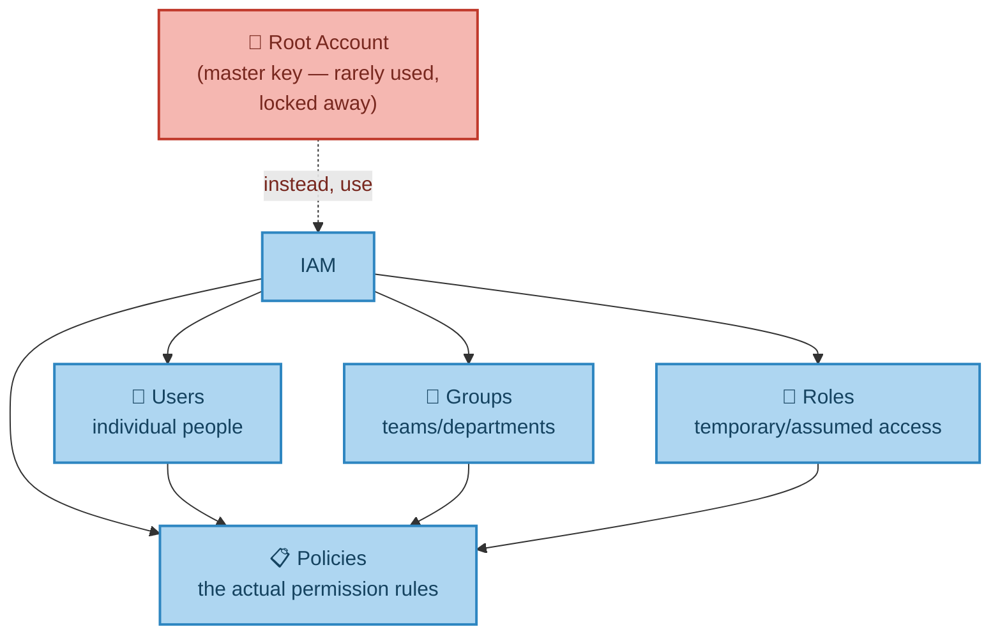
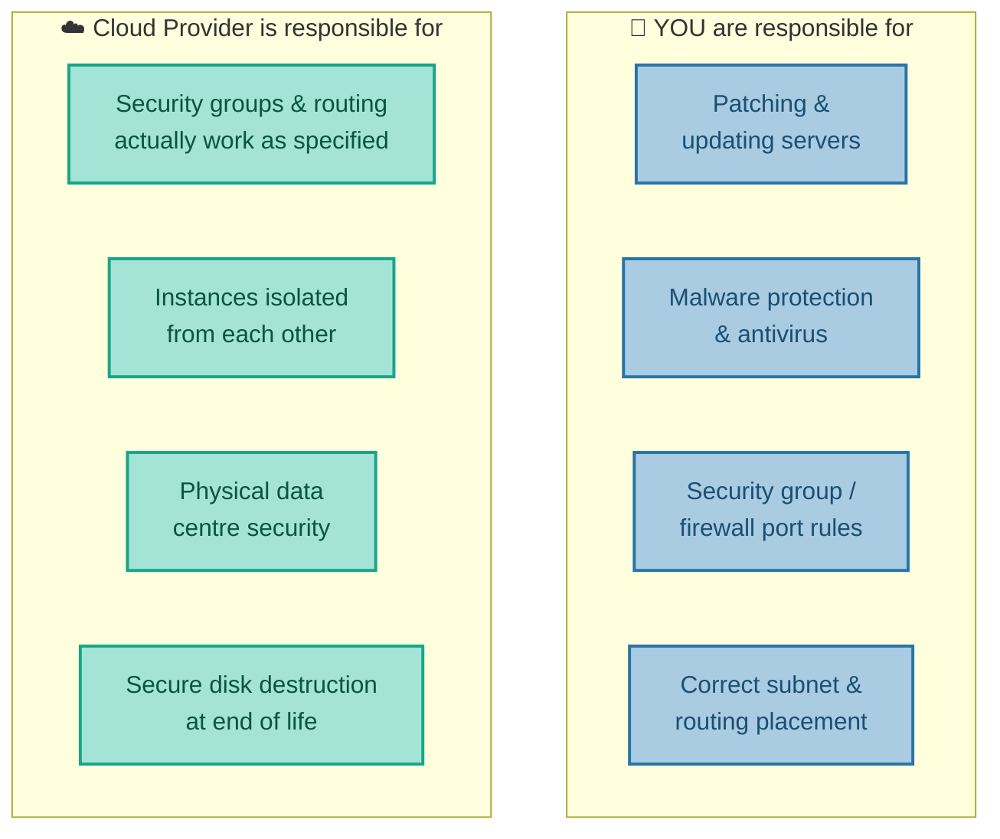
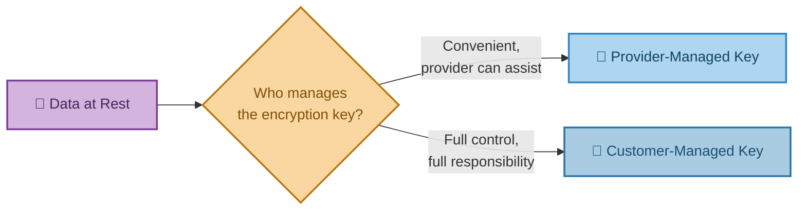

# Who's Responsible for What?
### Securing Your Account, Infrastructure & Data

---

## Introduction

Security in the cloud is not something a provider simply "does for you." It's a **shared responsibility** — and understanding exactly where that line sits between what the provider handles and what you handle yourself is the single most important, and most commonly misunderstood, concept in cloud security. This document covers three areas: securing your account (who can log in and do what), securing your infrastructure (servers and networking), and securing your data.

---

## 1. Securing Your Account — IAM and Azure AD

When an AWS account is first created, it comes with a root username and password — and this **should almost never be used day to day**. It should be locked away, kept as a last resort, because it has unlimited access to everything in the account, including billing.

Instead, AWS provides **IAM (Identity and Access Management)**, which lets you create:

- **Users** — individual people
- **Groups** — teams or departments
- **Roles** — temporary or assumed access, often used by services rather than people
- **Policies** — the actual rules defining what any of the above are allowed to do

(Azure's equivalent is **Azure Active Directory**, with **Roles** granting permissions to specific services.)

**Real-world analogy:** The root account is the building owner's master key, kept in a safe and used only for emergencies. IAM Users are individual staff keycards. IAM Groups are department-wide access profiles (e.g. "all of Finance can access the finance floor"). IAM Roles are temporary visitor badges that expire. IAM Policies are the actual rulebook defining which doors any given badge opens.

**Why individual accounts matter, not just shared logins:** if several people share one login, there's no way to tell *which* person actually took a given action — which becomes critical the moment something needs to be audited or investigated (more on this in the next document).

---

## 2. Securing Servers — The Shared Responsibility Model

This is the single most exam-relevant, interview-relevant idea in cloud security, so it's worth being precise about it.

**You are responsible for:**
- Patching and updating your own servers
- Malware protection and antivirus
- Configuring security groups (firewall rules) to only open the ports actually needed
- Placing servers in the correct subnets with correct routing rules

**The Cloud Provider is responsible for:**
- Making sure your configured security groups and routing rules actually work as specified
- Isolating your instances from other customers' instances running on the same underlying hardware
- The physical security of the data centre itself
- Securely destroying disks at the end of their life

**Real-world analogy — renting an apartment in a secure building:** The landlord (cloud provider) guarantees the building has a locked front entrance, CCTV, and that your neighbour can't walk through the wall into your flat. But if *you* leave your own apartment door wide open, that's not the landlord's failure — it's yours.

The takeaway to remember above all others: **the cloud provider secures the building. You still have to lock your own front door.**

---

## 3. Securing Data

The same shared-responsibility split applies to data specifically, not just servers:

- **You** are responsible for setting the appropriate permissions and access rights on your storage (S3 buckets, database tables, and so on).
- **The provider** is responsible for ensuring those permissions, once set, are actually enforced correctly, and for handling backups and patching of managed database services according to your configured schedule.

---

## 4. Encrypting Data

Many data services — blob storage, the hard drives attached to virtual machines — support **encryption at rest**, meaning the data is scrambled while sitting on disk, unreadable to anyone without the correct key, even someone with physical access to the drive itself. This encryption key can be provided by the cloud provider (managed for you) or provided and controlled by you directly.

**Real-world analogy:** A hotel safe. The hotel-managed key (provider-managed) is convenient — staff can technically open it in an emergency. A safe with your own combination (customer-managed key) means nobody, not even hotel staff, can open it without you — but if you forget the combination, nobody can help you either.

---

## 5. Bringing It All Together

| Concept | Real-World Analogy | Technical Meaning |
|---|---|---|
| Root Account | The building owner's master key | Full, unrestricted access — kept locked away, rarely used |
| IAM Users/Groups/Roles/Policies | Individual staff keycards & the rulebook | Fine-grained, individually-tracked access control |
| Shared Responsibility Model | Renting a secure apartment | Provider secures the building; you secure your own door |
| Encryption at Rest | A hotel safe | Data scrambled on disk, unreadable without the correct key |

**In summary:** cloud security starts with locking away the root account and using IAM to give individual people and services exactly the access they need — no more. From there, security follows a shared-responsibility split that repeats at every level: the provider guarantees the physical building and the correct functioning of the tools you configure, while you remain responsible for actually configuring those tools correctly — your firewall rules, your patching, your access permissions, and your encryption choices. The next document covers how to see, in detail, exactly who did what and when — and the automated tools that watch for trouble on your behalf.

---

*Prepared as a technical reference document.*
