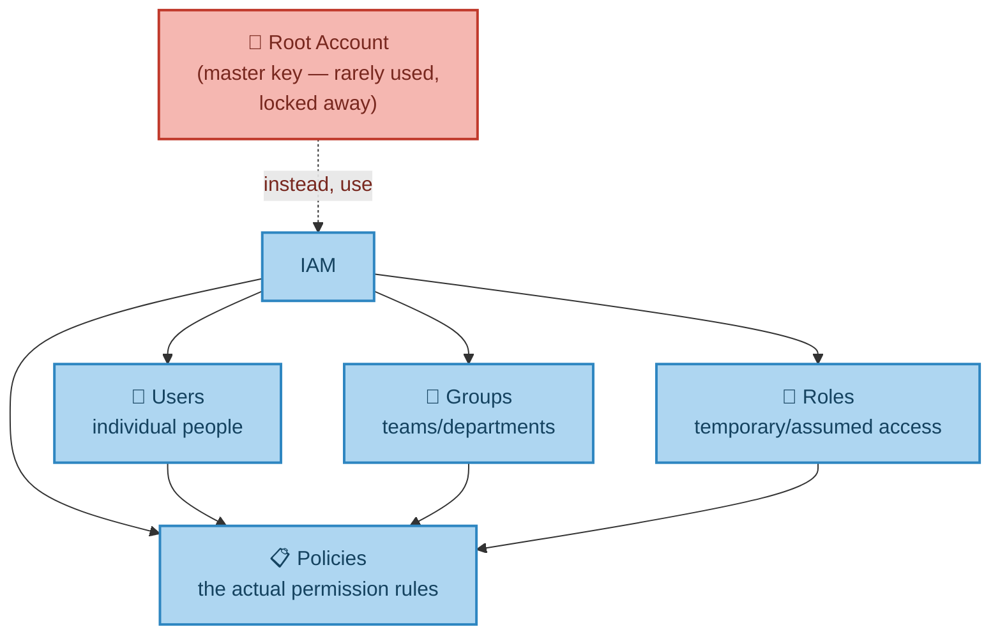
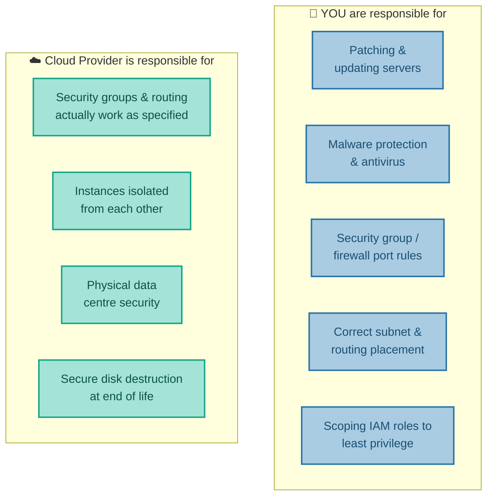
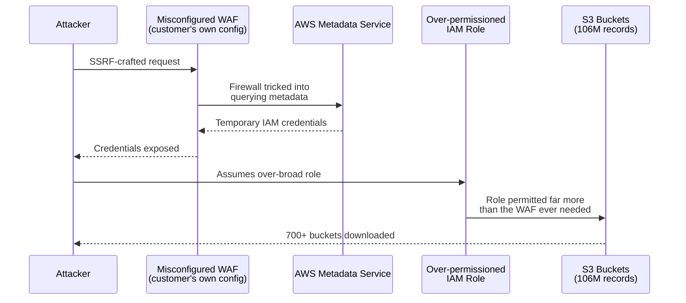
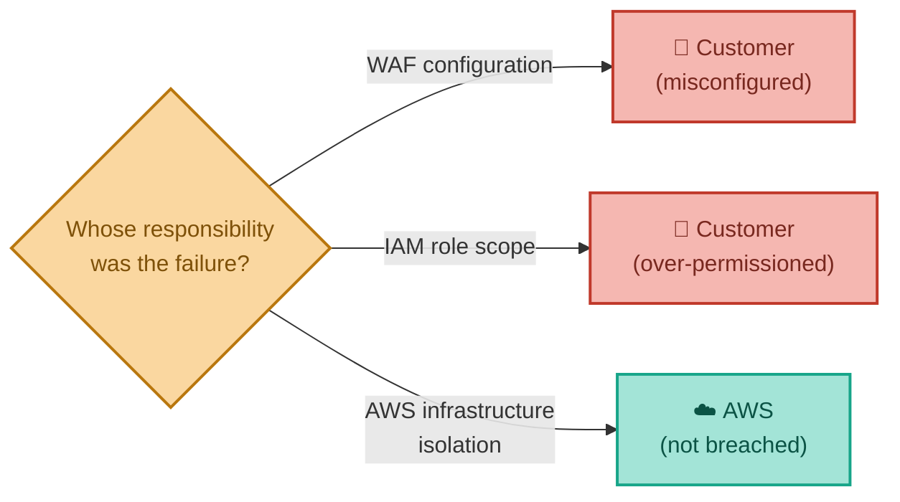
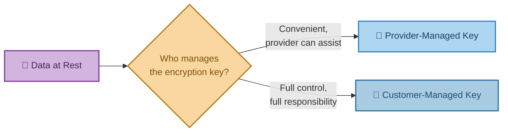

# Who's Responsible for What?
### Securing Your Account, Infrastructure & Data

---

## Introduction

Security in the cloud is not something a provider simply "does for you." It's a **shared responsibility** — and understanding exactly where that line sits between what the provider handles and what you handle yourself is the single most important, and most commonly misunderstood, concept in cloud security. This document covers three areas: securing your account (who can log in and do what), securing your infrastructure (servers and networking), and securing your data — illustrated throughout by one of the largest, most thoroughly documented breaches in cloud computing history.

---

## 1. Securing Your Account — IAM and Azure AD

When an AWS account is first created, it comes with a root username and password — and this **should almost never be used day to day**. It should be locked away, kept as a last resort, because it has unlimited access to everything in the account, including billing.

Instead, AWS provides **IAM (Identity and Access Management)**, which lets you create:

- **Users** — individual people
- **Groups** — teams or departments
- **Roles** — temporary or assumed access, often used by services rather than people
- **Policies** — the actual rules defining what any of the above are allowed to do

(Azure's equivalent is **Azure Active Directory**, with **Roles** granting permissions to specific services.)

**Real-world analogy:** The root account is the building owner's master key, kept in a safe and used only for emergencies. IAM Users are individual staff keycards. IAM Groups are department-wide access profiles (e.g. "all of Finance can access the finance floor"). IAM Roles are temporary visitor badges that expire. IAM Policies are the actual rulebook defining which doors any given badge opens.

**Why individual accounts matter, not just shared logins:** if several people share one login, there's no way to tell *which* person actually took a given action — which becomes critical the moment something needs to be audited or investigated. But there's an equally important, related principle that IAM Roles exist specifically to enforce, and which the story below shows going badly wrong: a Role should only ever be granted the *minimum* permissions the thing using it actually needs — a principle usually called **least privilege**.

---

## 2. Securing Servers — The Shared Responsibility Model

This is the single most exam-relevant, interview-relevant idea in cloud security, so it's worth being precise about it.

**You are responsible for:**
- Patching and updating your own servers
- Malware protection and antivirus
- Configuring security groups (firewall rules) to only open the ports actually needed
- Placing servers in the correct subnets with correct routing rules
- **Scoping IAM roles attached to your servers down to exactly what they need — no more**

**The Cloud Provider is responsible for:**
- Making sure your configured security groups and routing rules actually work as specified
- Isolating your instances from other customers' instances running on the same underlying hardware
- The physical security of the data centre itself
- Securely destroying disks at the end of their life
- Providing the tools (like IAM) needed to configure access correctly in the first place

**Real-world analogy — renting an apartment in a secure building:** The landlord (cloud provider) guarantees the building has a locked front entrance, CCTV, and that your neighbour can't walk through the wall into your flat. But if *you* leave your own apartment door wide open, that's not the landlord's failure — it's yours.

The takeaway to remember above all others: **the cloud provider secures the building. You still have to lock your own front door.**

### Real-World Story: How One Misconfigured Firewall Exposed 106 Million Records

In July 2019, one of the largest and most closely studied cloud data breaches in history became public — and it is, almost line for line, a demonstration of the shared responsibility model above going wrong on the customer's side of the line, not AWS's.

<cite index="180-1">Beginning on 22 March 2019, an attacker gained access to a major US bank's AWS environment and, over several months, downloaded data from more than 700 S3 buckets.</cite> The attacker, a former AWS employee, had found a flaw not in AWS itself, but in how the bank had configured one of its own components: a Web Application Firewall (WAF) running on an EC2 instance, intended to filter incoming web traffic. The WAF had been misconfigured in a way that made it vulnerable to a technique called **Server-Side Request Forgery (SSRF)** — tricking the firewall into making requests on the attacker's behalf.

Critically, that misconfigured WAF had an IAM Role attached to it, exactly like the Roles described in Section 1 — and that Role's permissions were far broader than a simple traffic filter should ever have needed. <cite index="179-1">By exploiting the SSRF flaw, the attacker was able to query AWS's internal metadata service, retrieve temporary credentials for that over-permissioned IAM role, and use them to access and download personal data belonging to roughly 106 million credit card applicants and customers.</cite>

<cite index="180-4">The breach wasn't caught by internal monitoring — it came to light when the attacker discussed it openly online, a tip-off was passed to the bank, and the breach was formally disclosed on 29 July 2019, the same day the attacker was arrested.</cite> <cite index="180-6">She was convicted on computer fraud charges in June 2022.</cite>

It's worth being precise about who was responsible for what here, because the case is sometimes told as "a cloud provider got hacked" — that's not what happened. AWS's own infrastructure, isolation, and physical security were never breached. Every failure in this chain sits squarely inside the "YOU are responsible for" box from the diagram above: a misconfigured customer-managed firewall, and an IAM role scoped far beyond what least privilege would allow. In direct response to this exact attack pattern, AWS later released an improved version of its metadata service specifically designed to make this style of SSRF-to-credential-theft attack significantly harder — a good example of the provider improving the *tools* available, which is its responsibility, while configuring those tools correctly always remains the customer's.

---

## 3. Securing Data

The same shared-responsibility split applies to data specifically, not just servers:

- **You** are responsible for setting the appropriate permissions and access rights on your storage (S3 buckets, database tables, and so on) — precisely the step that failed in the story above.
- **The provider** is responsible for ensuring those permissions, once set, are actually enforced correctly, and for handling backups and patching of managed database services according to your configured schedule.

---

## 4. Encrypting Data

Many data services — blob storage, the hard drives attached to virtual machines — support **encryption at rest**, meaning the data is scrambled while sitting on disk, unreadable to anyone without the correct key, even someone with physical access to the drive itself. This encryption key can be provided by the cloud provider (managed for you) or provided and controlled by you directly.

**Real-world analogy:** A hotel safe. The hotel-managed key (provider-managed) is convenient — staff can technically open it in an emergency. A safe with your own combination (customer-managed key) means nobody, not even hotel staff, can open it without you — but if you forget the combination, nobody can help you either.

Note that encryption at rest would **not** have prevented the breach described above — the attacker obtained legitimate, valid temporary credentials for a role that was authorised to read the data. Encryption defends against someone bypassing access controls entirely (e.g. physically stealing a disk); it does not defend against an attacker who has successfully obtained valid credentials through a misconfiguration. This is exactly why least-privilege IAM scoping and correct firewall configuration matter just as much as encryption — they're different layers of defence, not substitutes for one another.

---

## 5. Bringing It All Together

| Concept | Real-World Analogy | Technical Meaning |
|---|---|---|
| Root Account | The building owner's master key | Full, unrestricted access — kept locked away, rarely used |
| IAM Users/Groups/Roles/Policies | Individual staff keycards & the rulebook | Fine-grained, individually-tracked access control |
| Least Privilege | Giving a badge access only to the rooms it needs | Scoping permissions to the minimum necessary |
| Shared Responsibility Model | Renting a secure apartment | Provider secures the building; you secure your own door |
| Encryption at Rest | A hotel safe | Data scrambled on disk, unreadable without the correct key |
| The 2019 Breach | A badge with far more door access than its job required | Over-permissioned IAM role, reached via a misconfigured firewall |

**In summary:** cloud security starts with locking away the root account and using IAM to give individual people and services exactly the access they need — no more. From there, security follows a shared-responsibility split that repeats at every level: the provider guarantees the physical building and the correct functioning of the tools you configure, while you remain responsible for actually configuring those tools correctly — your firewall rules, your patching, your access permissions, your encryption choices, and, as the 2019 breach shows in stark detail, the *scope* of every IAM role you attach to anything. A single over-permissioned role, reached through one misconfigured component, was enough to expose 106 million records — not because AWS's infrastructure failed, but because the customer's side of the shared responsibility line wasn't drawn tightly enough. The next document covers how to see, in detail, exactly who did what and when — and the automated tools that watch for trouble on your behalf.

---

*Prepared as a technical reference document.*