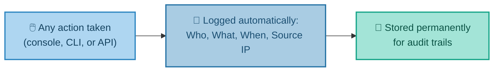
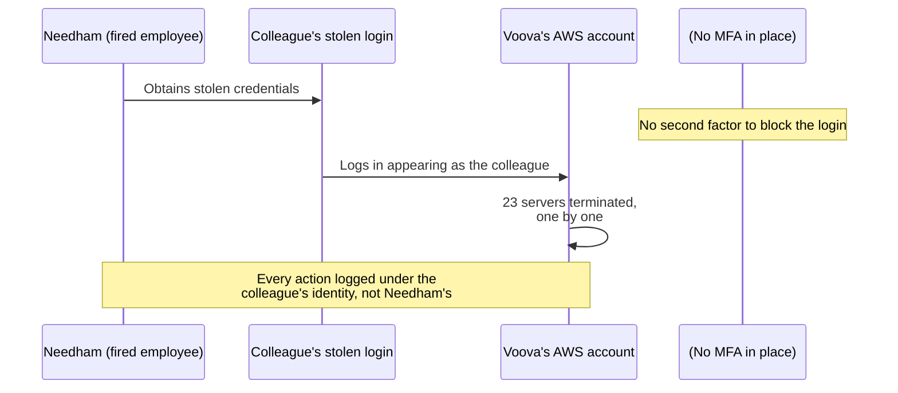
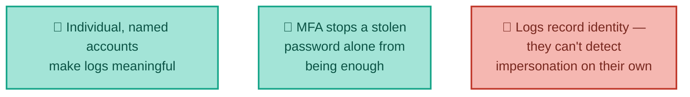
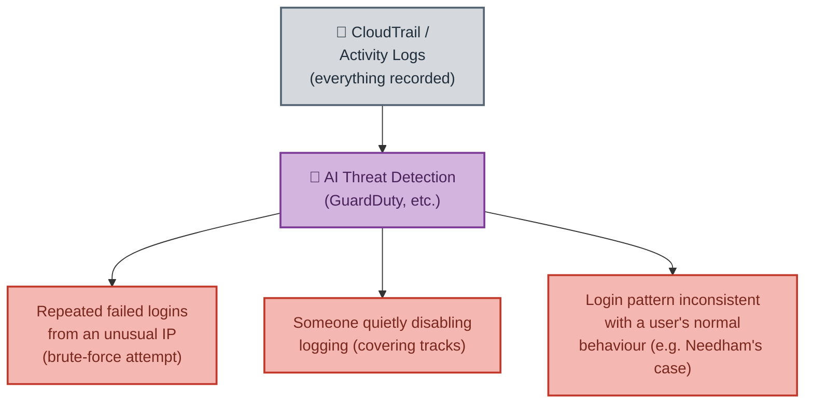
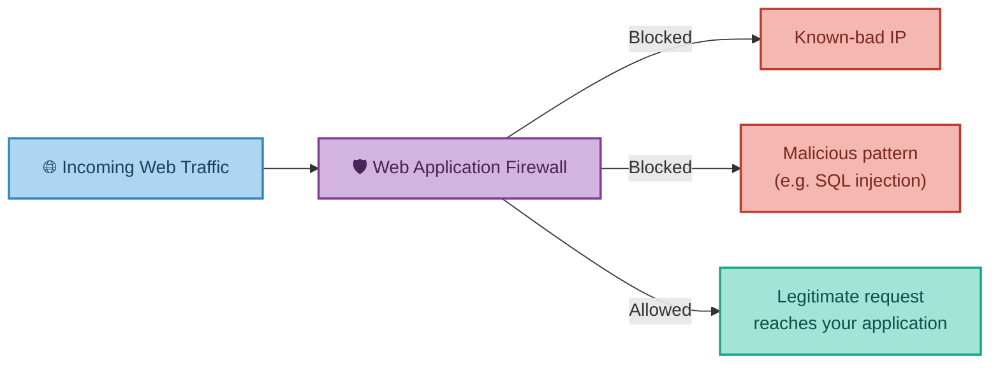
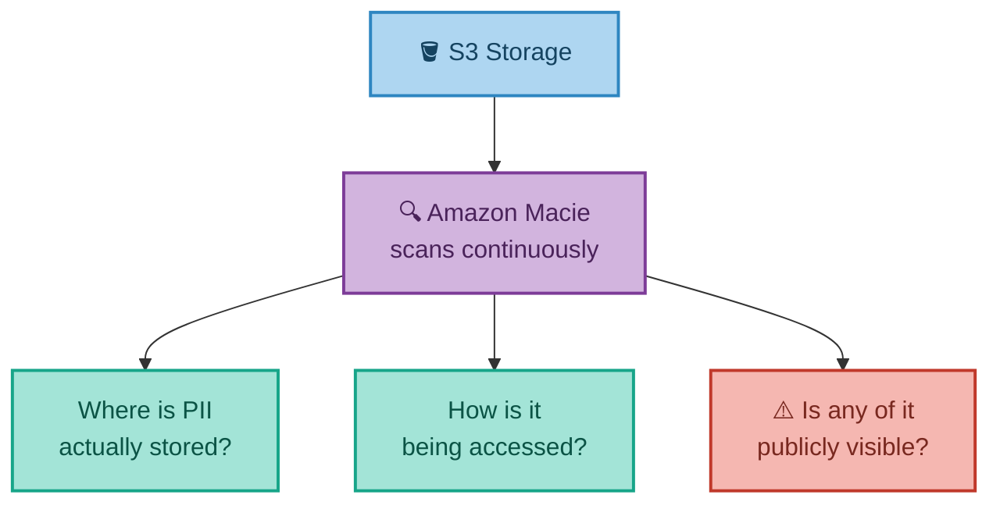

# Watching for Trouble
### Auditing, Threat Detection & Protection Tools

---

## Introduction

Locking down accounts and configuring the shared responsibility model correctly (covered in the previous document) is only half the picture. The other half is **visibility** — being able to see exactly who did what, and being alerted automatically when something looks wrong. This document covers the tools cloud providers offer for exactly that: audit logging, AI-driven threat detection, web firewalls, and sensitive-data discovery — opening with a real UK case that shows precisely what goes wrong when identity and access controls are treated as optional.

---

## 1. Auditing — Seeing Who Did What, and When

Cloud providers log every user action automatically: **CloudTrail** on AWS, **Activity Log** on Azure. These record who did what, when, and from where (source IP) — permanently, if configured to keep that history.

**Real-world analogy:** Every console click, every API call, every "who deleted that server?" question has an answer, permanently logged with a timestamp, username, and source IP — assuming logging hasn't been disabled (which is itself a loggable, suspicious action in its own right) and assuming, crucially, that the person taking the action was actually logged in as *themselves*.

That last caveat is not a minor detail — it's the entire subject of the story below.

### Real-World Story: The Sacked Employee, the Stolen Login, and 23 Deleted Servers

In 2016, a UK digital marketing and software company called Voova learned exactly why individual, named accounts (Section 1 of the previous document) and audit trails matter, in the most painful way possible.

<cite index="188-1">Steffan Needham had spent just four weeks working for Voova before being let go for "below-par performance."</cite> Rather than accepting this, <cite index="188-2">Needham obtained a former colleague's AWS login credentials and used them to methodically terminate the company's AWS servers, destroying what police and prosecutors valued at roughly £500,000 in business-critical data.</cite> <cite index="186-1">Voova lost a number of major contracts as a direct result, was forced to make staff redundant, and the destroyed data was never recovered.</cite>

<cite index="182-1">A security expert who testified during the trial was direct about the root cause: Voova had no multi-factor authentication in place — no second means of confirming that the person logging in as a given user genuinely was that person.</cite> <cite index="186-2">Needham was not traced and arrested until roughly ten months after the incident, only after being found working for a different company.</cite> <cite index="188-3">He was ultimately found guilty on two charges under the UK's Computer Misuse Act and sentenced to two years in prison.</cite>

This case is a near-perfect illustration of why the previous document insisted that shared logins undermine audit trails. Every single action Needham took was, from AWS's own logging perspective, technically attributable to his former colleague's account — because that is genuinely whose credentials were used. CloudTrail-style logging tells you *which identity* took an action; it cannot tell you *whether that identity's credentials were stolen*, unless something else — most commonly, multi-factor authentication — makes stolen credentials alone insufficient to log in.

The fix, identified explicitly during the trial, wasn't exotic or expensive: multi-factor authentication on every account, which would have required a second confirmation — typically a code sent to the genuine colleague's own phone — before Needham's login attempt could have succeeded at all.

---

## 2. Advanced Threat Detection — Letting AI Watch the Logs

Rather than a human manually reading through thousands of log entries, cloud providers offer AI-driven services that continuously monitor account activity and flag anomalies automatically:

- **AWS GuardDuty**
- **Azure Advanced Threat Protection** (databases only)
- **Google Cloud Armor**

**Real-world analogy:** CloudTrail is the building's CCTV footage — it records everything, but someone has to actively watch it. GuardDuty is an AI security guard that watches all the footage simultaneously and taps you on the shoulder the moment something looks wrong, instead of you finding out three weeks later during a routine review — or, as in the Voova case, ten months later.

Two realistic, common patterns these tools catch: a brute-force login attempt against a server (many failed logins from an unusual location in a short time), and an attempt to cover tracks by quietly disabling logging itself. A third — flagged in the diagram above — is precisely the kind of anomaly modern threat detection tools are designed to catch that a 2016-era manual audit process missed entirely: a login succeeding from an unusual location or at an unusual time for that particular user, even with technically valid credentials.

---

## 3. Web Firewalls — Filtering Traffic Before It Ever Arrives

A **Web Application Firewall (WAF)** lets you write rules blocking malicious traffic to your web-facing resources, based on things like IP address, geographic location, known SQL-injection patterns, or specific URL patterns — and these rules can be managed across many accounts at once, or just within one.

**Real-world analogy:** A bouncer at a club door with a very specific rulebook — block anyone from a banned list (IP), block anyone from a location the venue doesn't serve (geolocation), and refuse entry to anyone trying to sneak in something dangerous disguised as something innocent (SQL injection / malicious payloads).

It's worth connecting this back to the previous document's Capital One story: a WAF is a genuinely powerful protective tool, but only when it's configured correctly. A misconfigured WAF didn't just fail to protect in that case — it became the entry point for the entire breach. A web firewall reduces risk; it doesn't eliminate the need for every other layer covered in this document series.

---

## 4. Finding Sensitive Data Before It's a Problem

**Amazon Macie** automatically scans S3 storage to identify where personally identifiable information (PII) is being stored, provides insight into how that data is being accessed, and flags anything that's publicly visible. (There is currently no direct equivalent offered on Azure.)

**Why this matters:** sensitive data — national insurance numbers, card numbers, health records — has a habit of ending up in unexpected places, like a forgotten CSV export or a debug log. Macie continuously scans for these patterns and raises an alert before a compliance auditor — or an attacker — finds them first.

---

## 5. Where to Go for Best Practices

Each major provider publishes its own detailed security best-practice framework, worth bookmarking as ongoing reference rather than reading end to end in one sitting:

- **AWS** — the Well-Architected Framework's 5 Pillars
- **Azure** — the Security Best Practices and Patterns guide
- **Google Cloud** — the Security Foundations Guide

---

## 6. Bringing It All Together

| Concept | Real-World Analogy | Technical Meaning |
|---|---|---|
| CloudTrail / Activity Log | Building CCTV footage | Permanent log of every user action: who, what, when |
| GuardDuty / Threat Detection | An AI security guard watching all footage at once | Automated, AI-driven anomaly detection across account activity |
| Web Application Firewall | A bouncer with a specific rulebook | Rules blocking malicious traffic before it reaches your application |
| Amazon Macie | A specialist scanning for sensitive documents left in the open | Automated discovery of PII and public exposure risk in storage |
| The Voova Case, 2016 | A stolen staff keycard with no photo ID check | Logs recorded the wrong identity because no MFA stopped the impersonation |

**In summary:** securing a cloud environment doesn't end at configuration — it requires ongoing visibility. Audit logs like CloudTrail record every action so nothing happens invisibly, but as the Voova case shows in the starkest possible terms, a log is only as trustworthy as the identity behind it — which is exactly why multi-factor authentication and individually-named accounts, introduced in the previous document, matter as much as logging itself. AI-driven threat detection tools like GuardDuty exist precisely to catch the kind of anomaly a purely manual, after-the-fact audit missed for ten months in that case; web firewalls filter out malicious traffic before it ever reaches an application, provided they're configured correctly; and tools like Amazon Macie proactively hunt for sensitive data sitting somewhere it shouldn't be. Together with the account and infrastructure protections covered in the previous document, this completes the full picture of how cloud security actually works in practice — not as a single setting to switch on, but as a layered set of responsibilities and tools working together, each one covering a gap the others don't.

---

*Prepared as a technical reference document.*