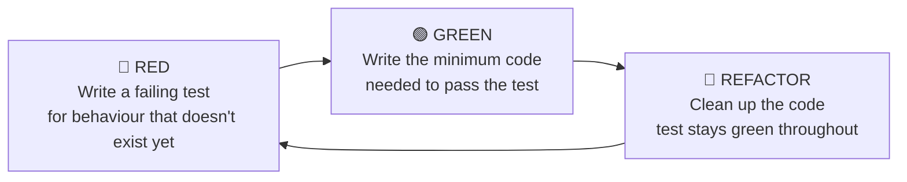

# 02 — Types of Testing

## 🔺 The Testing Pyramid

We already established the car analogy: a part supplier tests their part in isolation (unit test), Ford tests the assembled car (system test). But there are actually several layers between "one isolated part" and "the finished car driving down the road." This is usually drawn as a pyramid:

```
        /\
       /  \      End-to-End / Acceptance Tests   (few, slow, expensive)
      /----\
     /      \    Integration Tests
    /--------\
   /          \  Unit Tests                       (many, fast, cheap)
  /____________\
```

Mapped onto the car world:

| Pyramid Layer | Car World Equivalent | What It Verifies |
|---|---|---|
| **Unit tests** | Testing a single brake pad in a lab | One class/function works correctly, completely on its own |
| **Integration tests** | Testing that the brake pad + brake caliper + sensor work together | A small group of units work correctly *together* |
| **System tests** | Test-driving the fully assembled car | The whole system behaves correctly end-to-end |
| **Acceptance tests** | The customer test-drives the car before buying | The system meets the actual business/user requirement |

**Why the pyramid shape matters, not just the layers:** you want *many* fast, cheap unit tests at the bottom, and progressively *fewer* slow, expensive tests as you go up. A unit test runs in milliseconds and pinpoints exactly which "part" broke. A full end-to-end test might take minutes, needs a real (or near-real) environment running, and when it fails, it tells you *something* is wrong somewhere in a huge chain of components — not precisely what.

If you invert the pyramid — lots of slow end-to-end tests, few unit tests — your whole test suite becomes slow, flaky, and unhelpful at pinpointing bugs. This is a very common, very real mistake teams make.

---

## 💥 Real Incident: Knight Capital, Revisited

We opened File 1 with Knight Capital's $440 million loss in 45 minutes. It's worth coming back to it here, because it's actually a lesson about *which layer of the pyramid failed*.

The dead code path that caused the disaster wasn't necessarily a bug a unit test would have caught — the old code, in isolation, may well have "worked" exactly as originally designed years earlier. The real failure was at the **system/deployment level**: nobody had an automated system check verifying "this old feature flag is fully disabled across every single server before we call this deployment complete." That's not a unit test's job — a unit test only ever looks at one part in isolation. It's a system-level, integration-level responsibility to verify that the *assembled* set of eight servers were all in the state the team believed them to be in.

This is exactly why the pyramid has more than one layer. **Different bugs hide at different layers, and a suite made entirely of unit tests — no matter how good — will still miss integration and system-level problems, and vice versa.**

---

## 🔍 A Quick Walkthrough of Each Layer

### Unit Tests
Test a single function or class, completely isolated from its dependencies (databases, files, network, other classes). Fast, deterministic, and the foundation of everything else.

```python
def test_calculate_discount():
    # Arrange
    order = Order(total=100)

    # Act
    discounted = order.apply_discount(0.10)

    # Assert
    assert discounted == 90
```

### Integration Tests
Test that two or more real components work correctly *together* — for example, that your code correctly reads from an actual (test) database, or that two of your own classes correctly hand data to each other.

```python
def test_order_repository_saves_and_retrieves_order():
    # Arrange
    repository = OrderRepository(test_database_connection)
    order = Order(total=100)

    # Act
    repository.save(order)
    retrieved = repository.get(order.id)

    # Assert
    assert retrieved.total == 100
```

Notice: this one *does* touch a real database (a test one) — that's expected and fine at the integration layer. It's exactly what we said unit tests must never do.

### System / End-to-End Tests
Test the fully assembled application exactly as a user would experience it — often driving a real UI or hitting real API endpoints against a running instance of the whole system.

### Acceptance Tests
Verify the system satisfies the actual business requirement — often written collaboratively with non-engineers, in plain language ("Given a logged-in user with items in their cart, when they check out, then they receive a confirmation email").

---

## 🔁 TDD — Test-Driven Development

TDD flips the usual order of writing code. Instead of writing the feature first and testing it afterwards, you write the test **before** the code exists — and let the test guide what you build. It follows a short, repeating cycle known as **Red → Green → Refactor**:

1. **Red** — write a test for a behaviour that doesn't exist yet. Run it. It fails (there's nothing to make it pass).
2. **Green** — write the *minimum* amount of code needed to make that test pass. Not the elegant, complete solution — just enough to go green.
3. **Refactor** — now that you have a passing test protecting you, clean the code up: remove duplication, improve naming, simplify. Re-run the test after every change to confirm you haven't broken anything.

```python
# Red: write this test first — Calculator doesn't even exist yet
def test_add_two_numbers():
    calculator = Calculator()
    assert calculator.add(2, 3) == 5
```

Only *after* seeing this fail do you write `Calculator` and its `add` method — writing just enough to make the test pass, then refactoring.

**🔴 Diagram: TDD — Red, Green, Refactor cycle**



This loop repeats for every new piece of behaviour — small, deliberate, one test at a time.

**Why this order, and not the obvious "write code, then test it" order?** Writing the test first forces you to think about *how the code will be used* before you think about *how it will be implemented* — you're designing the interface from the caller's point of view. It also guarantees you never end up with untested code, because nothing gets written that didn't start as a failing test. TDD is a direct, disciplined answer to the "world without tests" problem from File 1: it makes untested code structurally impossible, because the test always comes first.

---

## 🗣️ BDD — Behaviour-Driven Development

BDD builds on the same spirit as TDD, but shifts the *language* tests are written in, so that **non-technical stakeholders** — product owners, business analysts, QA — can read and even help write them. Instead of a test named `test_add_two_numbers`, BDD frames behaviour as a plain-language scenario, typically in **Given / When / Then** form:

```
Feature: Umbrella recommendation

  Scenario: High chance of rain
    Given tomorrow's forecast shows an 80% chance of rain
    When the user checks whether to carry an umbrella
    Then the app should recommend carrying one
```

This maps directly onto the AAA structure you already know — **Given = Arrange, When = Act, Then = Assert** — just written in a form a product manager can read and sign off on without knowing Python. Tools like `behave` (Python) or Cucumber (multi-language) let these plain-language scenarios be linked to real, executable test code underneath.

**Where BDD fits in the pyramid:** because BDD scenarios describe *user-facing behaviour*, they tend to map most naturally onto the **acceptance testing** layer at the top of the pyramid — not a replacement for unit tests, but a complementary layer, written in language the whole team, not just engineers, can review and agree matches what the business actually wants.

**TDD vs BDD, in one line:** TDD is about *how* you build code (test-first, at the unit level, driven by engineers). BDD is about *what language* you describe behaviour in (plain, shared, at the acceptance level, driven collaboratively with the business). They aren't competing ideas — many teams use TDD to drive the low-level unit tests, and BDD to drive the high-level acceptance tests, at the same time.

---

## 🚀 Challenge Task

Pick a feature from any project you've worked on. Write down, in one sentence each:

- What a **unit test** for one part of that feature would check
- What an **integration test** for that feature would check
- What a **system/end-to-end test** for that feature would check

No solution provided. Bring your answer to the walkthrough.